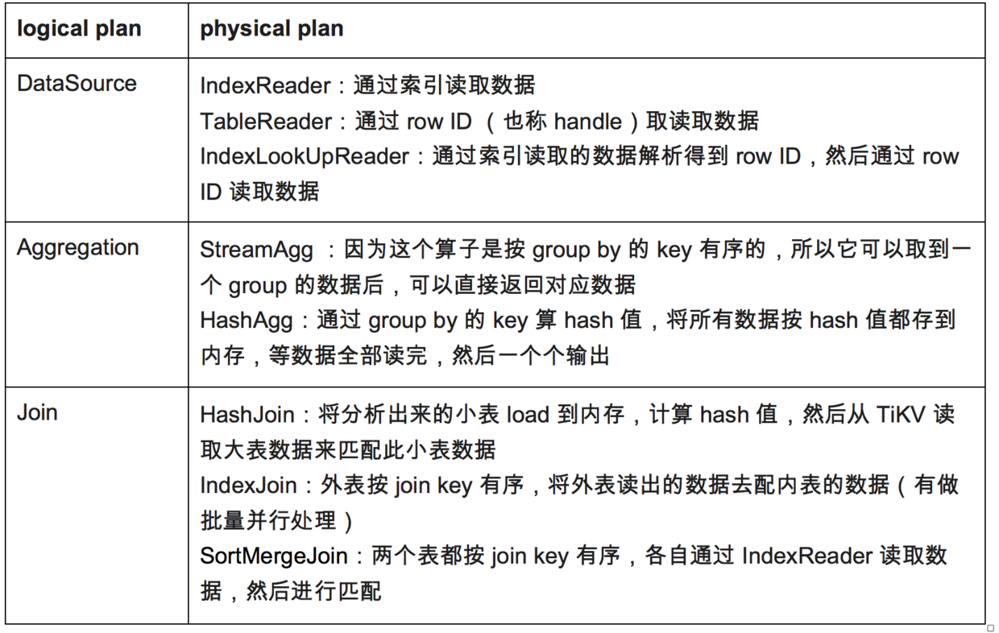
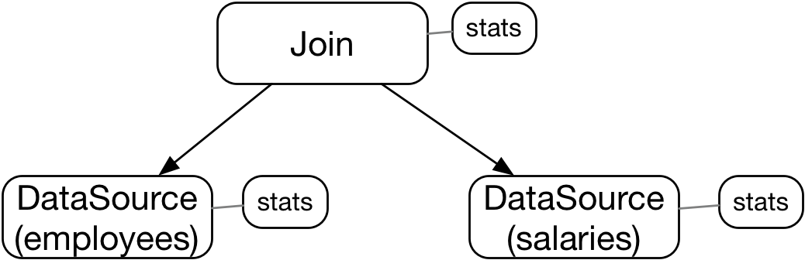
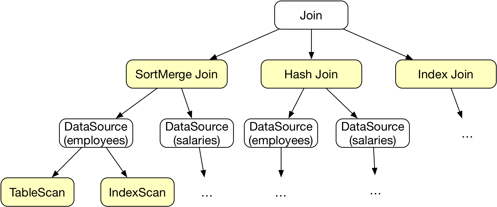

# 基于代价优化（CBO）实现代码导读

配合这篇[《基于代价的优化》](https://pingcap.com/blog-cn/tidb-source-code-reading-8/) 阅读。

**CBO的整体思路**是：从逻辑查询计划树，自上而下枚举每个逻辑运算符可能的物理算子，从所有可能的执行路径中选择一条评估代价最小的作为物理查询计划。

一个逻辑运算符受两个因素的影响，导致生成多个候选的物理执行计划：

* 逻辑运算符可能有多种候选的物理算子供选择，如下表：




* 有些物理算子会根据参与运算的属性、属性的顺序等因素，生成多种物理执行计划，例如`Join`的物理算子会根据参与连接的表的顺序，生成多种可能的执行计划。

CBO核心流程的代码在`plan/optimizer.go`中的`physicalOptimize`：

```
func physicalOptimize(logic LogicalPlan) (PhysicalPlan, error) {
	logic.preparePossibleProperties()
	_, err := logic.deriveStats()
	if err != nil {
		return nil, errors.Trace(err)
	}
	t, err := logic.findBestTask(&requiredProp{taskTp: rootTaskType, expectedCnt: math.MaxFloat64})
	if err != nil {
		return nil, errors.Trace(err)
	}
	p := t.plan()
	p.ResolveIndices()
	return p, nil
}
```

三行关键的代码：

* `logic.preparePossibleProperties()`：裁剪参与运算的属性，从而尽可能早的裁减掉成物理计划搜索路径上的分支
* `logic.deriveStats()`：为每个逻辑计划节点生成统计信息，为评估物理计划的代价做准备




* `logic.findBestTask`：生成执行代价最小的`task`

`findBestTask`的核心逻辑：

```
for _, pp := range p.self.exhaustPhysicalPlans(prop) {
	// find best child tasks firstly.
	childTasks = childTasks[:0]
	for i, child := range p.children {
		childTask, err := child.findBestTask(pp.getChildReqProps(i))
		if err != nil {
			return nil, errors.Trace(err)
		}
		childTasks = append(childTasks, childTask)
	}

	// combine best child tasks with parent physical plan.
	curTask := pp.attach2Task(childTasks...)

	// get the most efficient one.
	if curTask.cost() < bestTask.cost() {
		bestTask = curTask
	}
}
```

首先枚举可能的物理执行计划`p.self.exhaustPhysicalPlans`，然后遍历每种候选计划，找到代价最小的`task`。这是个递归的过程，当前节点的代价是由所有子节点的代价组成的，所以在遍历的过程中，又会调用` child.findBestTask(pp.getChildReqProps(i))`找到子节点的最佳`task`。




如何评估物理执行计划的代价呢？根据参与运算的关系（表）的统计信息进行评估。代价评估相关逻辑涉及的代码：

* 计算关系的统计信息：`plan/stats.go`
* 计算task的代价：`plan/task.go`中的`attach2Task`系列方法。


