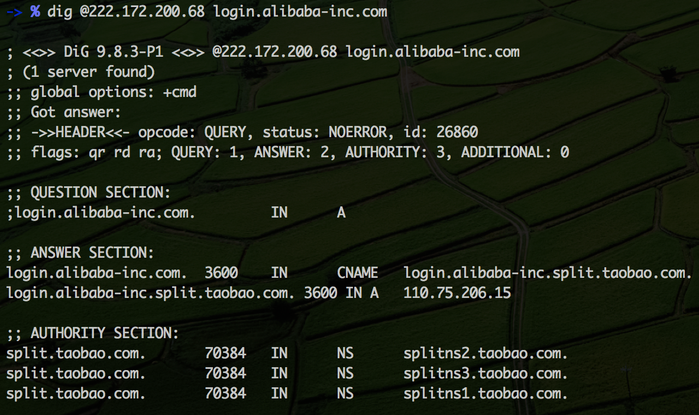
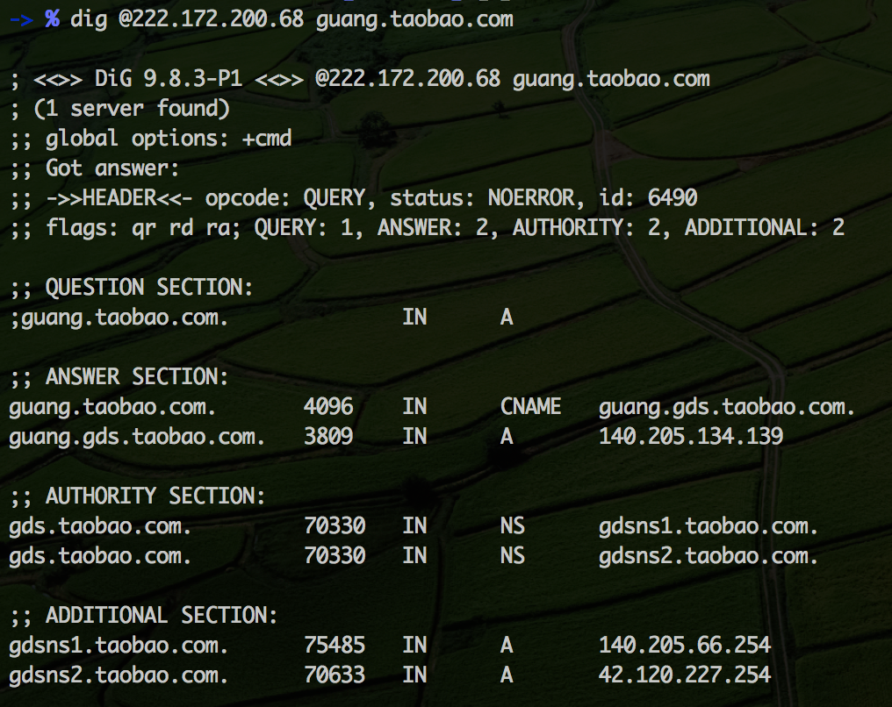
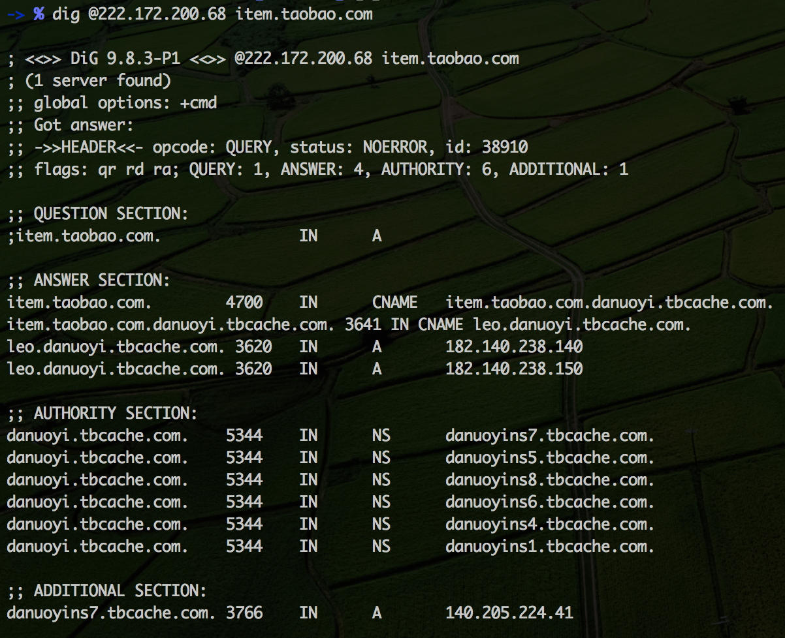
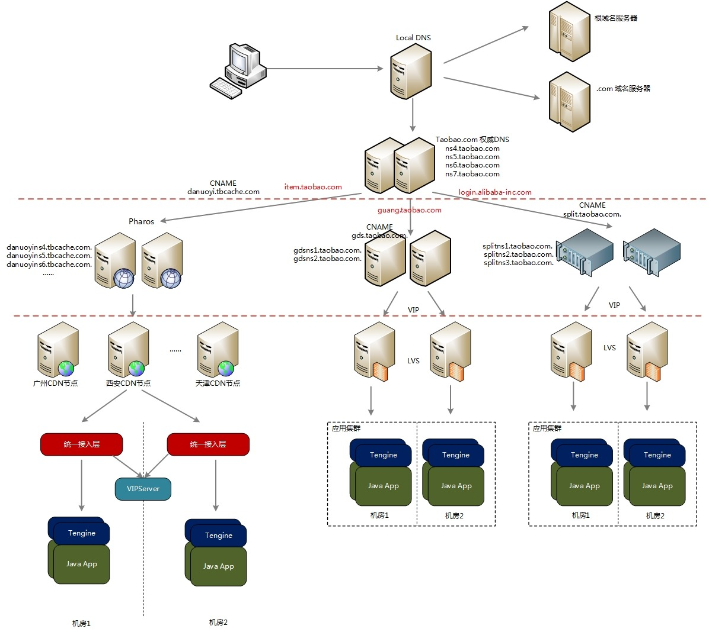

# 从开发角度看DNS

DNS（Domain Name System）简单说就是一个名称到IP地址的映射，使用容易记住的域名代替IP地址。基本原理就不讲了，网上的文章很多。

了解了基本原理，你就可以使用`dig`(Domain Information Groper）命令进行探索。当对淘宝的几个域名进行`dig`时，你发现事情并不像想像的那么简单。

为了使大家的输出一致，我在dig命令中显示的指定了DNS服务器（`@222.172.200.68` 云南电信DNS）。

- `dig @222.172.200.68 login.alibaba-inc.com`

- `dig @222.172.200.68 guang.taobao.com`

- `dig @222.172.200.68 item.taobao.com`

你会发现对于域名的查询，都不是直接返回IP地址这么简单，而是经过了神奇的`CNAME`。一般文档在介绍`CNAME`时只是说可以给一个域名指定别名（alias），其实这是`DNS`运维非常重要的手段，使得DNS配置具有一定的灵活性和可扩展性。结合上面三个域名的解析说一下。先给一张高大上的图，是按照我自己的理解画的，不一定完全正确:)

图上分了三层，最上层是常规的DNS解析过程，用户通过local DNS做递归查询，最终定位到taobao.com权威DNS服务器。

中间层可以称为`GSLB`（Global Server Load Balancing），作用是提供域名的智能解析，根据一定的策略返回结果。淘系目前有三套`GSLB`：

1. `F5 GTM`：F5的硬件设备，基本已经被淘汰，全部替换为自研软件。GTM功能强大，但对用户而言是黑盒，性能一般价格昂贵。早期淘宝CDN智能调度就是基于F5 GTM做的。
2. `ADNS`：阿里自研权威DNS，替换GTM。ADNS很牛逼，可惜资料太少。
3. `Pharos`：阿里CDN的大脑，实现CDN流量精确，稳定，安全的调度。

taobao.com权威DNS服务器会根据不用的域名，`CNAME`到不同的`GSLB`做智能调度。`CNAME`的作用有点类似请求分发，taobao.com权威DNS服务器将域名解析请求转交给下一层域名服务器处理。

最下层是应用层，提供真正的服务。

现在再看看这三个域名的解析。

- `login.alibaba-inc.com` 被转交给了`GTM`做智能解析，`GTM`通过返回不同机房的VIP做流量调度，用户的请求最终经过`LVS`到达我们的应用。

- `guang.taobao.com`的解析过程和`login.alibaba-inc.com`类似，只不过智能调度换成了`ADNS`。

- `item.taobao.com`有点小复杂。我们都知道`CDN`是做静态资源加速的，像这样的静态资源域名`img04.taobaocdn.com`会由`Pharos`解析调度，为用户返回就近的`CDN`节点。但什么时候动态内容也经过`CDN`代理了？这就是高大上的`统一接入层`。简单说下过程：`item.taobao.com`通过`Pharos`的智能调度，返回给用户就近的`CDN`节点。当用户的请求到达`CDN`节点时，这个节点会为动态内容的域名选择合适的后端服务，相当于每次都做回源处理。这个`CDN`节点可以理解为用户请求的代理。CDN在选择后端服务时，会执行`单元化`、`小淘宝`等逻辑，将请求发送到正确的机房。请求到达机房后，先进入`统一接入层`，注意这里的后端应用不需要申请`VIP`，IP地址列表保存在`VIPServer`中。`统一接入层`从`VIPServer`中拿到后端应用的IP地址列表，进行请求分发。`VIPServer`的作用类似`HSF`的`ConfigServer`，可以大大减少应用`VIP`的数量。以后做单元化部署的域名都会接入`统一接入层`，将单元化的逻辑上推到了`CDN`节点。

貌似是讲清楚了，不过这个过程已经做了很大的简化，因为我也仅仅是了解个大概。作为业务开发重点关注的是最下面的Java应用，转岗到技术保障后，才发现有机会可以从全局了解网站架构，接触到网络、DNS、CDN、LVS&VIP等等基础设施。

