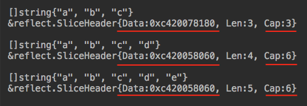
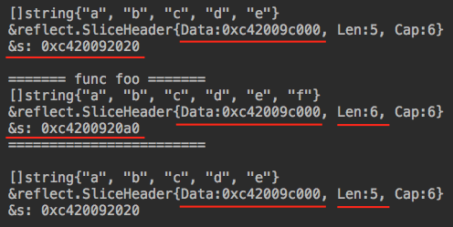

# Go语言的引用类型

Go中的引用类型不是指针，而是对指针的包装，在它的内部通过指针引用底层数据结构。每一种引用类型也包含一些其他的`field`，用来管理底层的数据结构。

看一个例子比较直观：

```
s := []string{"a","b", "c"}
fmt.Printf("%#v \n", (*reflect.SliceHeader)(unsafe.Pointer(&s)))
```

简单解释一下这段代码。先初始化一个`slice`，然后使用`unsafe.Pointer(&s)`把`slice`的指针转换为通用指针`Pointer`。[Pointer](https://golang.org/pkg/unsafe/#Pointer)是可以代表任何数据类型的指针。最后把`Pointer`强制转换为`*reflect.SliceHeader`。[SliceHeader](https://golang.org/pkg/reflect/#SliceHeader)代表的是`slice`运行时数据结构，定义如下：

```
type SliceHeader struct {
	Data uintptr
	Len  int
	Cap  int
}
```

可以看到，`SliceHeader`内部有一个用来指向底层数组的指针`Data`，另外还有两个属性`Len`和`Cap`用来保存`slice`的内部状态。

上面的代码运行结果如下：

`&reflect.SliceHeader{Data:0xc420078180, Len:3, Cap:3} `


`slice`可以自动扩容，当底层数组容量不够时，会自动创建一个新的数组替换。让我们做个实验：

```
s := []string{"a","b", "c"}
fmt.Printf("%#v \n", s)
fmt.Printf("%#v \n", (*reflect.SliceHeader)(unsafe.Pointer(&s)))
fmt.Println()

s = append(s, "d")
fmt.Printf("%#v \n", s)
fmt.Printf("%#v \n", (*reflect.SliceHeader)(unsafe.Pointer(&s)))
fmt.Println()

s = append(s, "e")
fmt.Printf("%#v \n", s)
fmt.Printf("%#v \n", (*reflect.SliceHeader)(unsafe.Pointer(&s)))
fmt.Println()
```

运行结果如下：



对于初始化容量为3的`slice`，在向这个`slice` append 新元素时，底层会创建一个容量翻倍的新数组，并将原先的内容复制过来，再将新元素`append`到最后。我们可以看到这个`slice`内部保存底层数组的指针在第一次`append`后，指向了新的地址。当再向它`append`新元素时，由于底层数组还有空间，内部指针保持不变，只是更新`Len`属性为5。

在Go中进行函数调用时，参数都是按值传递的。对于引用类型也是按值传递，会复制引用本身，但不会复制引用指向的底层数据结构。还是看代码：

```
func foo(s []string) {
	fmt.Println("======= func foo =======")
	s = append(s, "f")
	fmt.Printf("%#v \n", s)
	fmt.Printf("%#v \n", (*reflect.SliceHeader)(unsafe.Pointer(&s)))
	fmt.Printf("&s: %p \n", &s)
	fmt.Println("========================\n")
}

func main() {

   ......
   
	s = append(s, "e")
	fmt.Printf("%#v \n", s)
	fmt.Printf("%#v \n", (*reflect.SliceHeader)(unsafe.Pointer(&s)))
	fmt.Printf("&s: %p \n", &s)
	fmt.Println()

	foo(s)

	fmt.Printf("%#v \n", s)
	fmt.Printf("%#v \n", (*reflect.SliceHeader)(unsafe.Pointer(&s)))
	fmt.Printf("&s: %p \n", &s)
}
```

运行结果为：



在函数调用时，传递给函数的`slice`进行了复制，函数的参数是一个新的`slice`，但`slice`内部指针指向的底层数组还是同一个。

完整的示例代码在[https://play.golang.org/p/qwwSuskLfCa](https://play.golang.org/p/qwwSuskLfCa)，可以在Playground中直接运行。

Go语言的引用类型有`slice`, `map`, `channel`, `interface`和`function`。技术上，[string](https://golang.org/pkg/reflect/#StringHeader)也是引用类型：

```
type StringHeader struct {
        Data uintptr
        Len  int
}
```

有时候为了性能优化，可以利用`[]byte`和`string`头部结构的“部分相同”，以非安全的指针类型转换来实现类型变更，避免底层数组的复制。例如 `TiDB` 中就使用了这个[技巧](https://github.com/pingcap/tidb/blob/master/util/hack/hack.go)：

```
// String converts slice to string without copy.
// Use at your own risk.
func String(b []byte) (s string) {
	if len(b) == 0 {
		return ""
	}
	pbytes := (*reflect.SliceHeader)(unsafe.Pointer(&b))
	pstring := (*reflect.StringHeader)(unsafe.Pointer(&s))
	pstring.Data = pbytes.Data
	pstring.Len = pbytes.Len
	return
}

// Slice converts string to slice without copy.
// Use at your own risk.
func Slice(s string) (b []byte) {
	pbytes := (*reflect.SliceHeader)(unsafe.Pointer(&b))
	pstring := (*reflect.StringHeader)(unsafe.Pointer(&s))
	pbytes.Data = pstring.Data
	pbytes.Len = pstring.Len
	pbytes.Cap = pstring.Len
	return
}
```

上面两个函数实现了`[]byte`和`string`的互相转换，不需要底层数组的copy。

