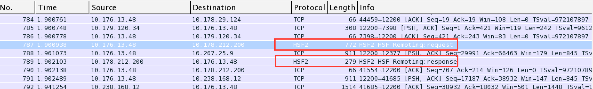
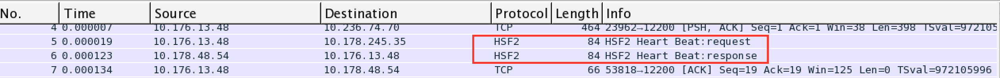
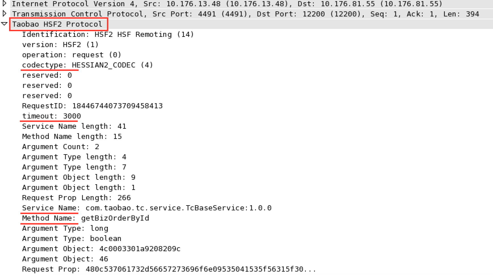
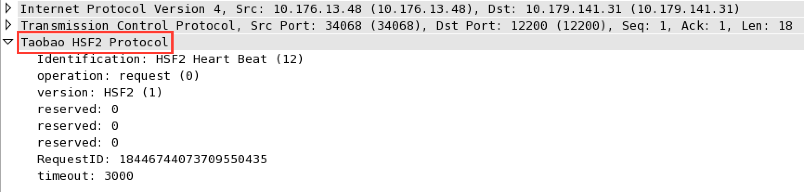

# 为Wireshark编写HSF2协议解析插件

`Wireshark`是排查网络问题最常用的工具，它已经内置支持了上百种通用协议，同时它的扩展性也很好，对于自定义的应用层网络协议，你可以使用`c`或者`lua`编写协议解析插件，这样你就可以在`Wireshark`中观察到协议的内容而不是二进制流，为排查问题带来一定的便利性。

最近在排查一个`HSF`超时的问题，顺便花了些时间为`Wireshark`写了一个`HSF2`协议解析插件，目前支持`HSF2`的`request`、`response`和`heart beat`协议，支持将多个`packet`还原为上层`PDU`。暂不支持HSF原先的TB Remoting协议。先看效果。

首先在Packet List区域已经能识别HSF2协议：

HSF的请求和响应




HSF的心跳协议




点击某个数据包，可以在Packet details区域查看详细的协议内容：
HSF请求




可以看到很多协议的重要信息，包括序列化方式，超时时间，服务名称、方法及参数

HSF响应


HeartBeat请求



心跳协议比较简单，响应就不看了。

插件是使用lua开发的，安装比较简单，以OS X平台为例：

1. 将协议解析脚本copy到`/Applications/Wireshark.app/Contents/Resources/share/wireshark/` 目录
2. 编辑`init.lua`文件，设置`disable_lua = false`，确保lua支持打开
3. 在`init.lua`文件末尾增加

    ```
    dofile("hsf2.lua")
    ```

再次启动`Wireshark`，会对12200端口的数据流使用脚本解析，已经可以识别`HSF`协议了。

**备注**

附上`hsf2.lua`，边翻`HSF`代码边写的，写完眼已经花了，错误难免，欢迎试用。

```
-- declare the protocol
hsf2_proto = Proto("hsf2", "Taobao HSF2 Protocol")

-- declare the value strings
local vs_id = {
    [12] = "HSF2 Heart Beat",
    [13] = "HSF2 TB Remoting",
    [14] = "HSF2 HSF Remoting"  
}

local vs_version = {
    [1] = "HSF2"
}

local vs_op = {
    [0] = "request",
    [1] = "response"
}

local vs_codectype = {
    [1] = "HESSIAN_CODEC",
    [2] = "JAVA_CODEC",
    [3] = "TOP_CODEC",
    [4] = "HESSIAN2_CODEC",
    [5] = "KRYO_CODEC",
    [6] = "JSON_CODEC",
    [7] = "CUSTOMIZED_CODEC",
}

local vs_responsestatus = {
    [20] = "OK",
    [30] = "client timeout",
    [31] = "server timeout",
    [40] = "bad request",
    [50] = "bad response",
    [60] = "service not found",
    [70] = "service error",
    [80] = "server error",
    [90] = "client error",
    [91] = "Unknow error",
    [81] = "Thread pool is busy",
    [82] = "Communication error",
    [88] = "server will close soon",
    [10] = "server send coders",
    [83] = "Unkown code"
}

-- declare the fields
local f_id = ProtoField.uint8("hsf2.id", "Identification", base.Dec, vs_id)
local f_version = ProtoField.uint8("hsf2.version", "version", base.Dec, vs_version)
local f_op = ProtoField.uint8("hsf2.op", "operation", base.DEC, vs_op)
local f_codectype = ProtoField.uint8("hsf2.codectype", "codectype", base.DEC, vs_codectype)
local f_reserved = ProtoField.uint8("hsf2.reserved", "reserved", base.DEC)
local f_req_id = ProtoField.uint64("hsf2.req_id", "RequestID", base.DEC)
local f_timeout = ProtoField.uint32("hsf2.timeout", "timeout", base.DEC)
local f_service_name_len = ProtoField.uint32("hsf2.service_name_len", "Service Name length", base.DEC)
local f_method_name_len = ProtoField.uint32("hsf2.method_name_len", "Method Name length", base.DEC)
local f_arg_count = ProtoField.uint32("hsf2.arg.count", "Argument Count", base.DEC)
local f_arg_type_len = ProtoField.uint32("hsf2.arg.type.len", "Argument Type length", base.DEC)
local f_arg_obj_len = ProtoField.uint32("hsf2.arg.obj.len", "Argument Object length", base.DEC)
local f_req_prop_len = ProtoField.uint32("hsf2.req.prop.len", "Request Prop Length", base.DEC)
local f_service_name = ProtoField.string("hsf2.service.name", "Service Name")
local f_method_name = ProtoField.string("hsf2.method.name", "Method Name")
local f_arg_type = ProtoField.string("hsf2.arg.type", "Argument Type")
local f_arg_obj = ProtoField.bytes("hsf2.arg.obj", "Argument Object")
local f_req_prop = ProtoField.bytes("hsf2.req.prop", "Request Prop")

local f_response_status = ProtoField.uint32("hsf2.response.status", "Response Status", base.DEC, vs_responsestatus)
local f_response_body_len = ProtoField.uint32("hsf2.response.body.len", "Response Body Length", base.DEC)
local f_response_body = ProtoField.bytes("hsf2.response.body", "Response Body", base.DEC)


hsf2_proto.fields = { f_id, f_version, f_op, f_codectype, f_reserved, f_req_id, f_timeout, 
                      f_service_name_len, f_method_name_len, f_arg_count, f_arg_type_len, f_arg_obj_len, f_req_prop_len,
                      f_service_name, f_method_name, f_arg_type, f_arg_obj, f_req_prop, 
                      f_response_status, f_response_body_len, f_response_body
                    }


function get_pdu_length(buffer)
    local offset =  0
    local id = buffer(offset, 1):uint()
    offset = offset + 1
    -- heart beat
    if id  == 12 then
        return 18 
    end
    -- TB REMOTING
    if id == 13 then
      -- TODO
        return 18
    end
    -- HSF REMOTING
    if id == 14 then
        local version = buffer(offset, 1):uint()
        offset = offset + 1
        local op = buffer(offset, 1):uint()
        offset = offset + 1
        -- request
        if op == 0 then
          local service_name_len = buffer(19, 4):uint()
          local method_name_len = buffer(23,4):uint()
          local arg_count = buffer(27,4):uint()
          
          offset = 27 + 4
          local arg_content_len = 0
          for i = 1, arg_count do 
              arg_content_len = arg_content_len + buffer(offset,4):uint()
              offset = offset + 4
          end
          for i = 1, arg_count  do 
              arg_content_len = arg_content_len + buffer(offset,4):uint()
              offset = offset + 4
          end
          local req_prop_len = buffer(offset,4):uint()
          
          local len = 30 + arg_count*4*2 + 5 + service_name_len + method_name_len + arg_content_len + req_prop_len
          return len
        end
        -- response
        if op == 1 then
            local body_len = buffer(16, 4):uint()
            return 20 + body_len
        end
    end
end

-- create the dissection function
function hsf2_proto.dissector(buffer, pinfo, tree)
    
    -- check the protocol
    -- TODO support TB Remoting
    local check_proto = buffer(0, 1):uint()
    if check_proto < 12 or check_proto > 14 or check_proto == 13 then
        return
    end

    -- Set the protocol column
    pinfo.cols['protocol'] = "HSF2"

    -- Reassembling packets into one PDU
    local pdu_len = get_pdu_length(buffer)
    if pdu_len > buffer:len() then
        pinfo.desegment_len = pdu_len - buffer:len()
        pinfo.desegment_offset = 0
        return
    end

    -- create the HSF2 protocol tree item
    local t_hsf2 = tree:add(hsf2_proto, buffer())
    local offset = 0

    local id = buffer(offset, 1):uint()
    offset = offset + 1
    t_hsf2:add(f_id, id)
    
    -- heart beat
    if id  == 12 then
        local op = buffer(offset, 1):uint()
        offset = offset + 1
        t_hsf2:add(f_op, op)

        -- Set the info column to the name of the function
        local info = vs_id[id]..":"..vs_op[op]
        pinfo.cols['info'] = info

        t_hsf2:add(f_version, buffer(offset, 1))
        offset = offset + 1
        t_hsf2:add(f_reserved, buffer(offset, 1))
        offset = offset + 1
        t_hsf2:add(f_reserved, buffer(offset, 1))
        offset = offset + 1
        t_hsf2:add(f_reserved, buffer(offset, 1))
        offset = offset + 1
        t_hsf2:add(f_req_id, buffer(offset, 8))
        offset = offset + 8
        t_hsf2:add(f_timeout, buffer(offset, 4))
    end
    -- TB REMOTING
    if id == 13 then
      -- TODO        
    end
    -- HSF REMOTING
    if id == 14 then        
        t_hsf2:add(f_version, buffer(offset, 1))
        offset = offset + 1
        local op = buffer(offset, 1):uint()
        offset = offset + 1
        t_hsf2:add(f_op, op)

        -- Set the info column to the name of the function
        local info = vs_id[id]..":"..vs_op[op]
        pinfo.cols['info'] = info

        -- request
        if op == 0 then
          t_hsf2:add(f_codectype, buffer(offset, 1))
          offset = offset + 1
          t_hsf2:add(f_reserved, buffer(offset, 1))
          offset = offset + 1
          t_hsf2:add(f_reserved, buffer(offset, 1))
          offset = offset + 1
          t_hsf2:add(f_reserved, buffer(offset, 1))
          offset = offset + 1
          t_hsf2:add(f_req_id, buffer(offset, 8))
          offset = offset + 8
          t_hsf2:add(f_timeout, buffer(offset, 4))
          offset = offset + 4

          local service_name_len = buffer(offset, 4):uint()
          t_hsf2:add(f_service_name_len, service_name_len)
          offset = offset +  4

          local method_name_len = buffer(offset,4):uint()
          t_hsf2:add(f_method_name_len, method_name_len)
          offset = offset +  4

          local arg_count = buffer(offset,4):uint()
          t_hsf2:add(f_arg_count, arg_count)
          offset = offset +  4
          
          local arg_type_len_array = {}
          for i = 1, arg_count do
              arg_type_len_array[i] = buffer(offset, 4):uint();
              offset = offset +  4
              t_hsf2:add(f_arg_type_len, arg_type_len_array[i])
          end

          local arg_obj_len_array = {}
          for i = 1, arg_count do
              arg_obj_len_array[i] = buffer(offset, 4):uint();
              offset = offset +  4
              t_hsf2:add(f_arg_obj_len, arg_obj_len_array[i])
          end

          local prop_len = buffer(offset, 4):uint();
          offset = offset +  4
          t_hsf2:add(f_req_prop_len, prop_len)

          t_hsf2:add(f_service_name, buffer(offset, service_name_len))
          offset = offset +  service_name_len

          t_hsf2:add(f_method_name, buffer(offset, method_name_len))
          offset = offset +  method_name_len

          for i = 1, #arg_type_len_array do
              t_hsf2:add(f_arg_type, buffer(offset, arg_type_len_array[i]))
              offset = offset +  arg_type_len_array[i]
          end

          for i = 1, #arg_obj_len_array do
              t_hsf2:add(f_arg_obj, buffer(offset, arg_obj_len_array[i]))
              offset = offset +  arg_obj_len_array[i]
          end

          if prop_len > 0 then
              t_hsf2:add(f_req_prop, buffer(offset, prop_len))
          end

        end

        -- response
        if op == 1 then
            t_hsf2:add(f_response_status, buffer(offset, 1))
            offset = offset + 1
            t_hsf2:add(f_codectype, buffer(offset, 1))
            offset = offset + 1
            t_hsf2:add(f_reserved, buffer(offset, 1))
            offset = offset + 1
            t_hsf2:add(f_reserved, buffer(offset, 1))
            offset = offset + 1
            t_hsf2:add(f_reserved, buffer(offset, 1))
            offset = offset + 1
            t_hsf2:add(f_req_id, buffer(offset, 8))
            offset = offset +  8

            local body_len = buffer(offset, 4):uint()
            t_hsf2:add(f_response_body_len, body_len)
            offset = offset +  4

            t_hsf2:add(f_response_body, buffer(offset, body_len))
        end
    end
end

-- load the tcp port table
tcp_table = DissectorTable.get("tcp.port")
-- register the protocol to port 12200
tcp_table:add(12200, hsf2_proto)
```

