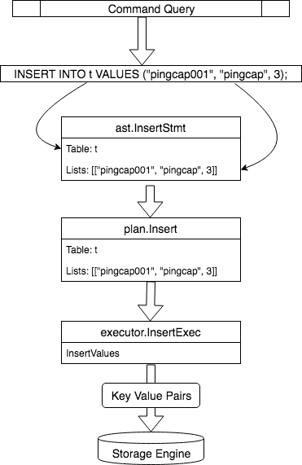

# TiDB Insert 执行流程图

TiDB源码解读系列的[《Insert语句概览》](https://pingcap.com/blog-cn/tidb-source-code-reading-4/)讲解了`Insert`执行的整体流程，并在最后用一幅图描述了整个流程：

我按照自己的理解对这幅图扩展了一下，在原先数据结构转换流程的基础上，补充了代码的调用流程，个人感觉更加全面，希望对你阅读代码也有帮助。

