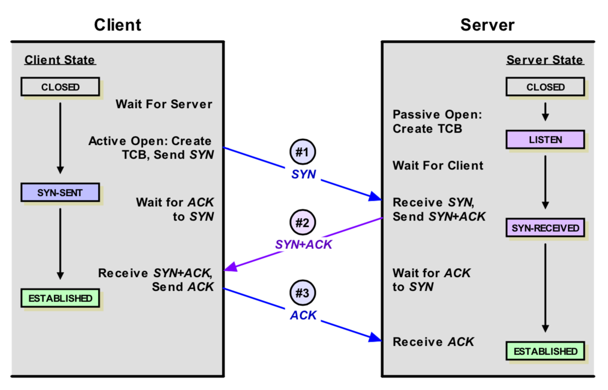
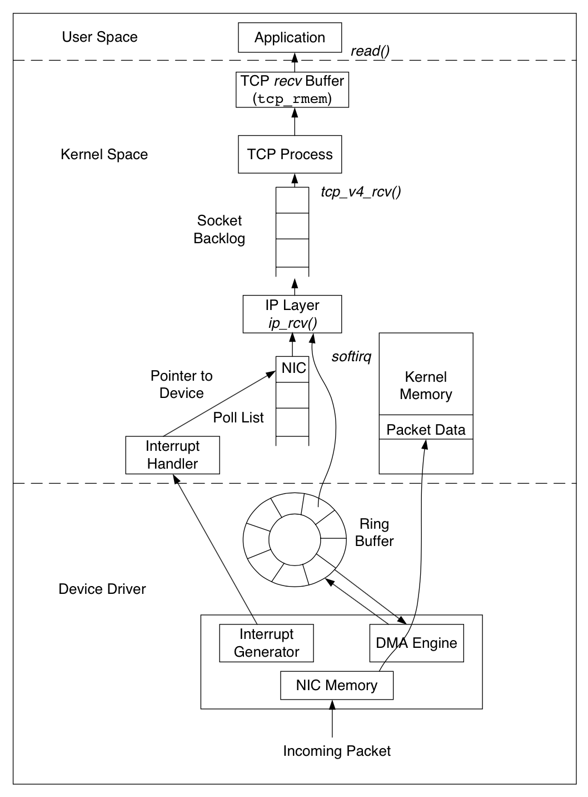
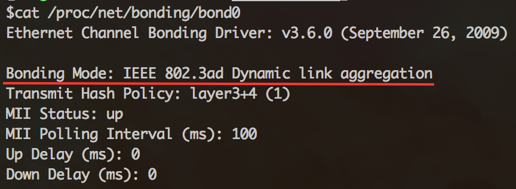
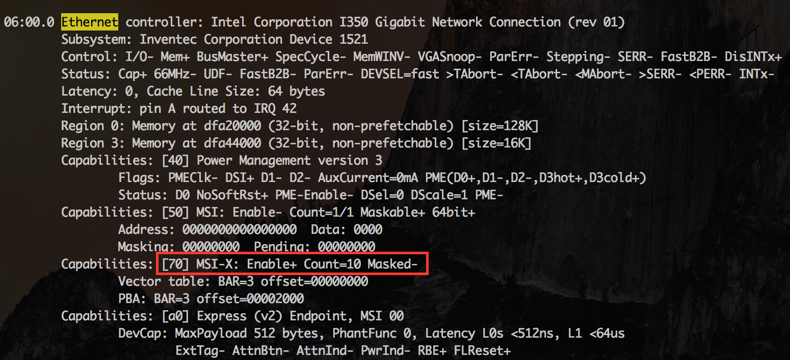
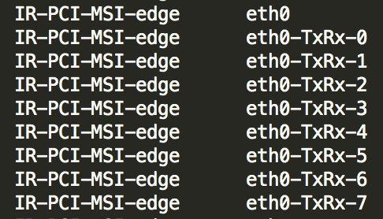
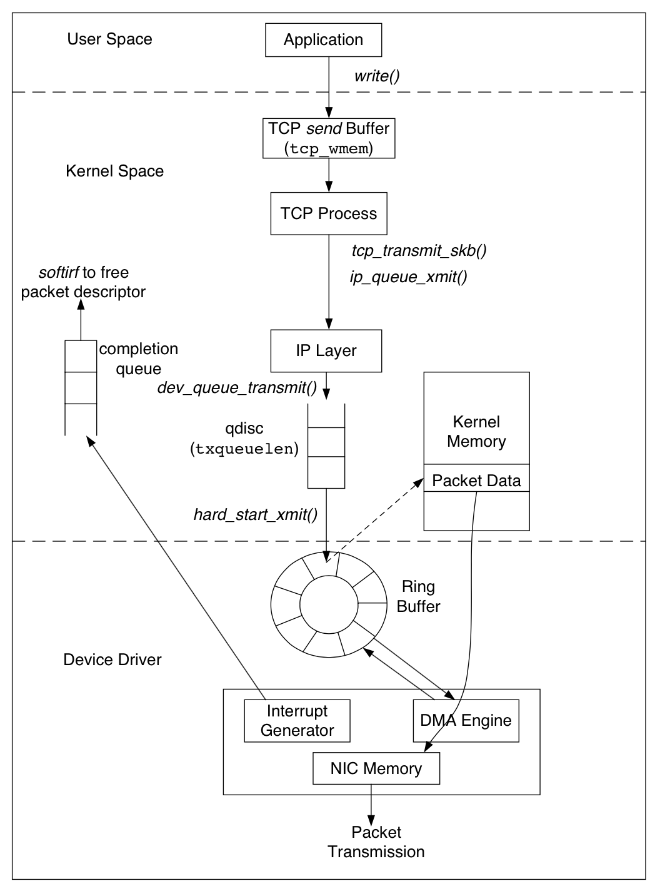
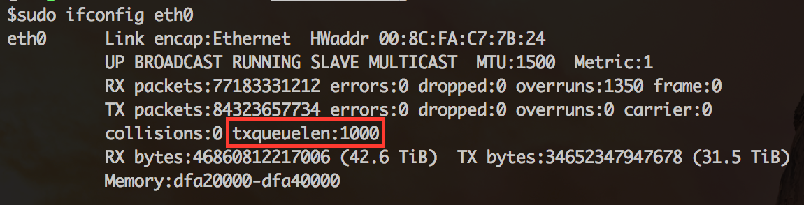
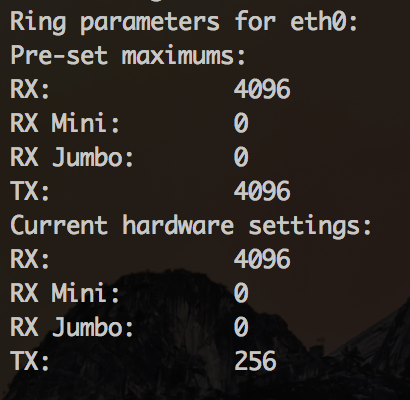
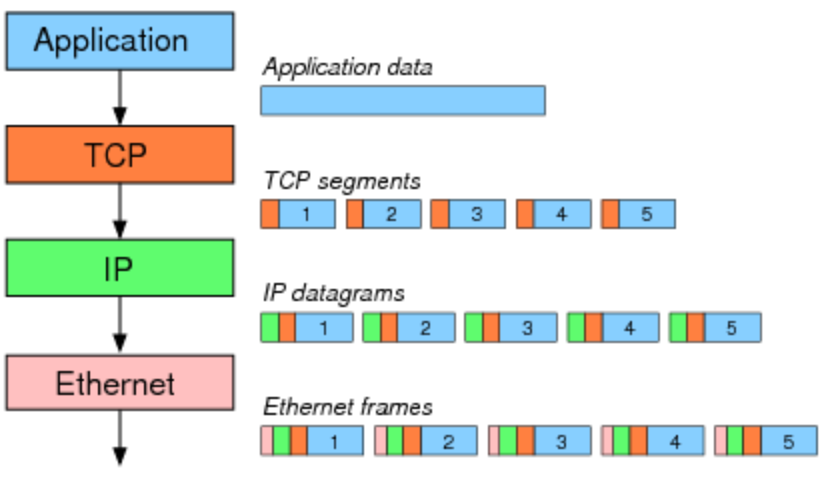
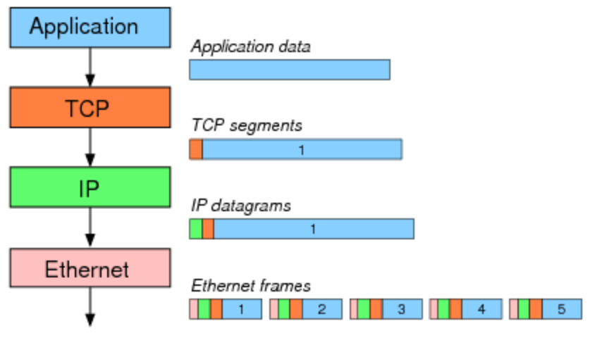

# Linux TCP队列相关参数的总结

在Linux上做网络应用的性能优化时，一般都会对TCP相关的内核参数进行调节，特别是和缓冲、队列有关的参数。网上搜到的文章会告诉你需要修改哪些参数，但我们经常是知其然而不知其所以然，每次照抄过来后，可能很快就忘记或混淆了它们的含义。本文尝试总结TCP队列缓冲相关的内核参数，从协议栈的角度梳理它们，希望可以更容易的理解和记忆。注意，本文内容均来源于参考文档，没有去读相关的内核源码做验证，不能保证内容严谨正确。作为Java程序员没读过内核源码是硬伤。

下面我以server端为视角，从**连接建立**、**数据包接收**和**数据包发送**这3条路径对参数进行归类梳理。

### 一、连接建立



简单看下连接的建立过程，客户端向server发送`SYN`包，server回复`SYN＋ACK`，同时将这个处于`SYN_RECV`状态的连接保存到半连接队列。客户端返回`ACK`包完成三次握手，server将`ESTABLISHED`状态的连接移入`accept`队列，等待应用调用`accept()`。

可以看到建立连接涉及两个队列：

- **半连接队列**，保存`SYN_RECV`状态的连接。队列长度由`net.ipv4.tcp_max_syn_backlog`设置
- **accept队列**，保存`ESTABLISHED`状态的连接。队列长度为`min(net.core.somaxconn, backlog)`。其中`backlog`是我们创建`ServerSocket(int port,int backlog)`时指定的参数，最终会传递给`listen`方法：

    ```
    #include <sys/socket.h>
    int listen(int sockfd, int backlog);
    ```
    
如果我们设置的`backlog`大于`net.core.somaxconn`，`accept`队列的长度将被设置为`net.core.somaxconn`

另外，为了应对`SYN flooding`（即客户端只发送SYN包发起握手而不回应ACK完成连接建立，填满server端的半连接队列，让它无法处理正常的握手请求），Linux实现了一种称为`SYN cookie`的机制，通过`net.ipv4.tcp_syncookies`控制，设置为1表示开启。简单说`SYN cookie`就是将连接信息编码在`ISN`(initial sequence number)中返回给客户端，这时server不需要将半连接保存在队列中，而是利用客户端随后发来的ACK带回的`ISN`还原连接信息，以完成连接的建立，避免了半连接队列被攻击`SYN`包填满。对于一去不复返的客户端握手，不理它就是了。

### 二、数据包的接收

先看看接收数据包经过的路径：




数据包的接收，从下往上经过了三层：网卡驱动、系统内核空间，最后到用户态空间的应用。Linux内核使用`sk_buff`([socket kernel buffers](http://vger.kernel.org/~davem/skb.html))数据结构描述一个数据包。当一个新的数据包到达，`NIC`（network interface controller）调用`DMA engine`，通过`Ring Buffer`将数据包放置到内核内存区。`Ring Buffer`的大小固定，它不包含实际的数据包，而是包含了指向`sk_buff`的描述符。当`Ring Buffer`满的时候，新来的数据包将给丢弃。一旦数据包被成功接收，`NIC`发起中断，由内核的中断处理程序将数据包传递给IP层。经过IP层的处理，数据包被放入队列等待TCP层处理。每个数据包经过TCP层一系列复杂的步骤，更新TCP状态机，最终到达`recv Buffer`，等待被应用接收处理。有一点需要注意，数据包到达`recv Buffer`，TCP就会回`ACK`确认，既TCP的`ACK`表示数据包已经被操作系统内核收到，但并不确保应用层一定收到数据（例如这个时候系统crash），因此一般建议应用协议层也要设计自己的`ACK`确认机制。

上面就是一个相当简化的数据包接收流程，让我们逐层看看队列缓冲有关的参数。

1. **网卡Bonding模式**

  当主机有1个以上的网卡时，Linux会将多个网卡绑定为一个虚拟的bonded网络接口，对TCP/IP而言只存在一个bonded网卡。多网卡绑定一方面能够提高网络吞吐量，另一方面也可以增强网络高可用。Linux支持7种Bonding模式：
  
    - `Mode 0 (balance-rr)` Round-robin策略，这个模式具备负载均衡和容错能力
    - `Mode 1 (active-backup)` 主备策略，在绑定中只有一个网卡被激活，其他处于备份状态
    - `Mode 2 (balance-xor)` XOR策略，通过源MAC地址与目的MAC地址做异或操作选择slave网卡
    - `Mode 3 (broadcast)` 广播，在所有的网卡上传送所有的报文
    - `Mode 4 (802.3ad)`  IEEE 802.3ad 动态链路聚合。创建共享相同的速率和双工模式的聚合组
    - `Mode 5 (balance-tlb)` Adaptive transmit load balancing
    - `Mode 6 (balance-alb)` Adaptive load balancing

  详细的说明参考内核文档[Linux Ethernet Bonding Driver HOWTO](https://www.kernel.org/doc/Documentation/networking/bonding.txt)。我们可以通过`cat /proc/net/bonding/bond0`查看本机的Bonding模式：




  一般很少需要开发去设置网卡Bonding模式，自己实验的话可以参考[这篇文档](http://linux.cloudibee.com/2009/10/linux-network-bonding-setup-guide/)

2. **网卡多队列及中断绑定**

  随着网络的带宽的不断提升，单核CPU已经不能满足网卡的需求，这时通过多队列网卡驱动的支持，可以将每个队列通过中断绑定到不同的CPU核上，充分利用多核提升数据包的处理能力。
  
  首先查看网卡是否支持多队列，使用`lspci -vvv`命令，找到`Ethernet controller`项：



  
  如果有MSI-X， Enable+ 并且Count > 1，则该网卡是多队列网卡。
  
  然后查看是否打开了网卡多队列。使用命令`cat /proc/interrupts`，如果看到eth0-TxRx-0表明多队列支持已经打开：
  


  
  最后确认每个队列是否绑定到不同的CPU。`cat /proc/interrupts`查询到每个队列的中断号，对应的文件`/proc/irq/${IRQ_NUM}/smp_affinity`为中断号`IRQ_NUM`绑定的CPU核的情况。以十六进制表示，每一位代表一个CPU核：
   
    ```
    （00000001）代表CPU0
    （00000010）代表CPU1
    （00000011）代表CPU0和CPU1
    ```
  
  如果绑定的不均衡，可以手工设置，例如：
  
    ```
    echo "1" > /proc/irq/99/smp_affinity  
    echo "2" > /proc/irq/100/smp_affinity  
    echo "4" > /proc/irq/101/smp_affinity  
    echo "8" > /proc/irq/102/smp_affinity  
    echo "10" > /proc/irq/103/smp_affinity  
    echo "20" > /proc/irq/104/smp_affinity  
    echo "40" > /proc/irq/105/smp_affinity  
    echo "80" > /proc/irq/106/smp_affinity  
    ```

3. **Ring Buffer**

   `Ring Buffer`位于NIC和IP层之间，是一个典型的FIFO（先进先出）[环形队列](http://en.wikipedia.org/wiki/Circular_buffer)。`Ring Buffer`没有包含数据本身，而是包含了指向`sk_buff`（[socket kernel buffers](http://vger.kernel.org/~davem/skb.html)）的描述符。
   
  可以使用`ethtool -g eth0`查看当前`Ring Buffer`的设置：
  
  

  上面的例子接收队列为4096，传输队列为256。可以通过`ifconfig`观察接收和传输队列的运行状况：
  
  

  - **RX errors**：收包总的错误数
  - **RX dropped**: 表示数据包已经进入了`Ring Buffer`，但是由于内存不够等系统原因，导致在拷贝到内存的过程中被丢弃。
  - **RX overruns**: `overruns`意味着数据包没到`Ring Buffer`就被网卡物理层给丢弃了，而CPU无法及时的处理中断是造成`Ring Buffer`满的原因之一，例如中断分配的不均匀。   
  
  当`dropped`数量持续增加，建议增大`Ring Buffer`，使用`ethtool -G`进行设置。

4. **Input Packet Queue(数据包接收队列)**

  当接收数据包的速率大于内核TCP处理包的速率，数据包将会缓冲在TCP层之前的队列中。接收队列的长度由参数`net.core.netdev_max_backlog`设置。
 
5. **recv Buffer**

  `recv buffer`是调节TCP性能的关键参数。`BDP`(Bandwidth-delay product，带宽延迟积) 是网络的带宽和与`RTT`(round trip time)的乘积，`BDP`的含义是任意时刻处于在途未确认的最大数据量。`RTT`使用`ping`命令可以很容易的得到。为了达到最大的吞吐量，`recv Buffer`的设置应该大于`BDP`，即`recv Buffer >= bandwidth * RTT`。假设带宽是100Mbps，`RTT`是100ms，那么`BDP`的计算如下：
  
  ```
  BDP = 100Mbps * 100ms = (100 / 8) * (100 / 1000) = 1.25MB
  ```
  
  Linux在2.6.17以后增加了`recv Buffer`自动调节机制，`recv buffer`的实际大小会自动在最小值和最大值之间浮动，以期找到性能和资源的平衡点，因此大多数情况下不建议将`recv buffer`手工设置成固定值。
  
  当`net.ipv4.tcp_moderate_rcvbuf`设置为1时，自动调节机制生效，每个TCP连接的recv Buffer由下面的3元数组指定：
  
  ```
  net.ipv4.tcp_rmem = <MIN> <DEFAULT> <MAX>
  ```
  
  最初`recv buffer`被设置为<DEFAULT>，同时这个缺省值会覆盖`net.core.rmem_default`的设置。随后`recv buffer`根据实际情况在最大值和最小值之间动态调节。在缓冲的动态调优机制开启的情况下，我们将`net.ipv4.tcp_rmem`的最大值设置为`BDP`。
  
  当`net.ipv4.tcp_moderate_rcvbuf`被设置为0，或者设置了socket选项`SO_RCVBUF`，缓冲的动态调节机制被关闭。`recv buffer`的缺省值由`net.core.rmem_default`设置，但如果设置了`net.ipv4.tcp_rmem`，缺省值则被`<DEFAULT>`覆盖。可以通过系统调用`setsockopt()`设置`recv buffer`的最大值为`net.core.rmem_max`。在缓冲动态调节机制关闭的情况下，建议把缓冲的缺省值设置为`BDP`。
  
  注意这里还有一个细节，缓冲除了保存接收的数据本身，还需要一部分空间保存socket数据结构等额外信息。因此上面讨论的`recv buffer`最佳值仅仅等于`BDP`是不够的，还需要考虑保存socket等额外信息的开销。Linux根据参数`net.ipv4.tcp_adv_win_scale`计算额外开销的大小：
  
  Buffer / 2<sup>tcp\_adv\_win\_scale</sup>
  
  如果`net.ipv4.tcp_adv_win_scale`的值为1，则二分之一的缓冲空间用来做额外开销，如果为2的话，则四分之一缓冲空间用来做额外开销。因此`recv buffer`的最佳值应该设置为：
  
  BDP / (1 – 1 / 2<sup>tcp\_adv\_win\_scale</sup>)

### 三、数据包的发送

发送数据包经过的路径：





和接收数据的路径相反，数据包的发送从上往下也经过了三层：用户态空间的应用、系统内核空间、最后到网卡驱动。应用先将数据写入TCP `send buffer`，TCP层将`send buffer`中的数据构建成数据包转交给IP层。IP层会将待发送的数据包放入队列`QDisc`(queueing discipline)。数据包成功放入`QDisc`后，指向数据包的描述符`sk_buff`被放入`Ring Buffer`输出队列，随后网卡驱动调用`DMA engine`将数据发送到网络链路上。

同样我们逐层来梳理队列缓冲有关的参数。

1. **send Buffer**

  同`recv Buffer`类似，和`send Buffer`有关的参数如下：
  
  ```
  net.ipv4.tcp_wmem = <MIN> <DEFAULT> <MAX>
  net.core.wmem_default
  net.core.wmem_max
  ```
  
  发送端缓冲的自动调节机制很早就已经实现，并且是无条件开启，没有参数去设置。如果指定了`tcp_wmem`，则`net.core.wmem_default`被`tcp_wmem`的<DEFAULT>覆盖。`send Buffer`在`tcp_wmem`的最小值和最大值之间自动调节。如果调用`setsockopt()`设置了socket选项`SO_SNDBUF`，将关闭发送端缓冲的自动调节机制，`tcp_wmem`将被忽略，`SO_SNDBUF`的最大值由`net.core.wmem_max`限制。

2. **QDisc**

  `QDisc`（queueing discipline ）位于IP层和网卡的`ring buffer`之间。我们已经知道，`ring buffer`是一个简单的FIFO队列，这种设计使网卡的驱动层保持简单和快速。而`QDisc`实现了流量管理的高级功能，包括流量分类，优先级和流量整形（rate-shaping）。可以使用`tc`命令配置`QDisc`。
  
  `QDisc`的队列长度由`txqueuelen`设置，和接收数据包的队列长度由内核参数`net.core.netdev_max_backlog`控制所不同，`txqueuelen`是和网卡关联，可以用`ifconfig`命令查看当前的大小：
  


  使用`ifconfig`调整`txqueuelen`的大小：
  
  ```
  ifconfig eth0 txqueuelen 2000
  ```

3. **Ring Buffer**

  和数据包的接收一样，发送数据包也要经过`Ring Buffer`，使用`ethtool -g eth0`查看：
  
  
  
  其中`TX`项是`Ring Buffer`的传输队列，也就是发送队列的长度。设置也是使用命令`ethtool -G`。

4. **TCP Segmentation和Checksum Offloading**

  操作系统可以把一些TCP/IP的功能转交给网卡去完成，特别是Segmentation(分片)和checksum的计算，这样可以节省CPU资源，并且由硬件代替`OS`执行这些操作会带来性能的提升。
  
  一般以太网的`MTU`（Maximum Transmission Unit）为1500 bytes，假设应用要发送数据包的大小为7300bytes，`MTU`1500字节 － IP头部20字节 － TCP头部20字节＝有效负载为1460字节，因此7300字节需要拆分成5个segment：
  
  
  
  `Segmentation`(分片)操作可以由操作系统移交给网卡完成，虽然最终线路上仍然是传输5个包，但这样节省了CPU资源并带来性能的提升：
  
  
  
  可以使用`ethtool -k eth0`查看网卡当前的offloading情况：


  上面这个例子`checksum`和`tcp segmentation`的`offloading`都是打开的。如果想设置网卡的`offloading`开关，可以使用`ethtool -K`(注意K是大写)命令，例如下面的命令关闭了tcp segmentation offload：
  
  ```
  sudo ethtool -K eth0 tso off
  ```

5. **网卡多队列和网卡Bonding模式**

  在数据包的接收过程中已经介绍过了。

至此，终于梳理完毕。整理TCP队列相关参数的起因是最近在排查一个网络超时问题，原因还没有找到，产生的“副作用”就是这篇文档。再想深入解决这个问题可能需要做TCP协议代码的profile，需要继续学习，希望不久的将来就可以再写文档和大家分享了。

**参考文档**

* [Queueing in the Linux Network Stack](http://www.linuxjournal.com/content/queueing-linux-network-stack)
* [TCP Implementation in Linux: A Brief Tutorial](http://www.ece.virginia.edu/cheetah/documents/papers/TCPlinux.pdf)
* [Impact of Bandwidth Delay Product on TCP Throughput](http://sandilands.info/sgordon/impact-of-bandwidth-delay-product-on-tcp-throughput)
* [Java程序员也应该知道的系统知识系列之网卡](http://hellojava.info/?p=292)


