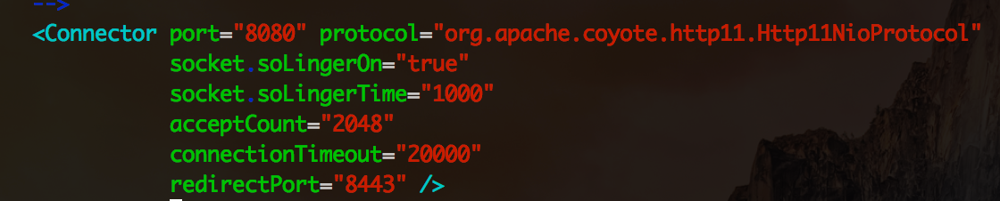
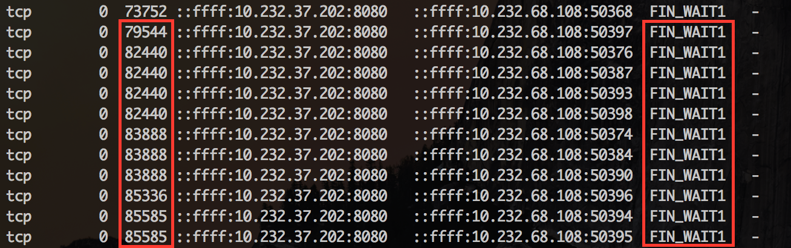
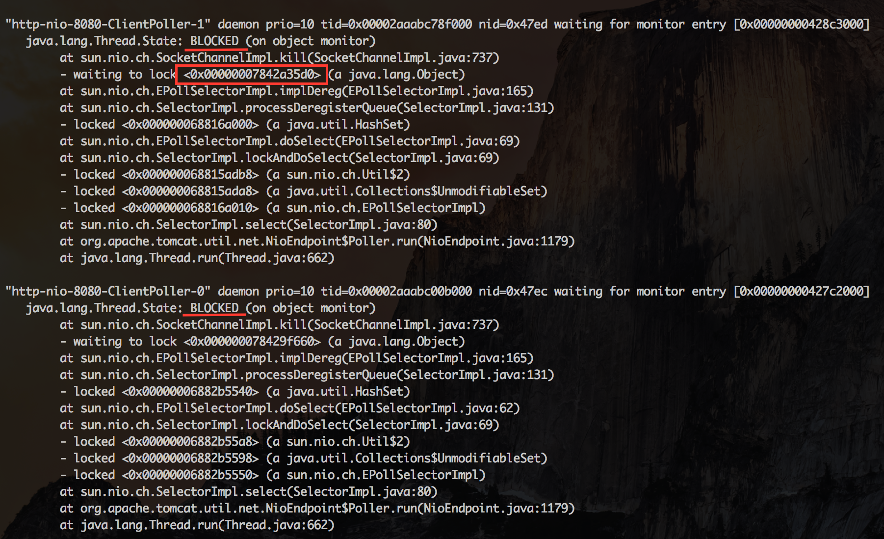
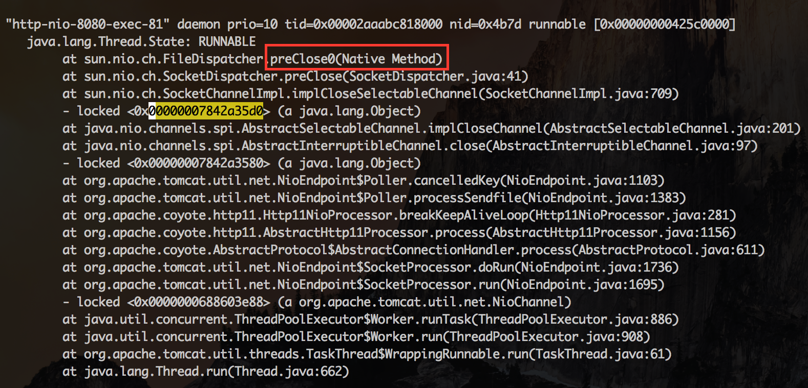
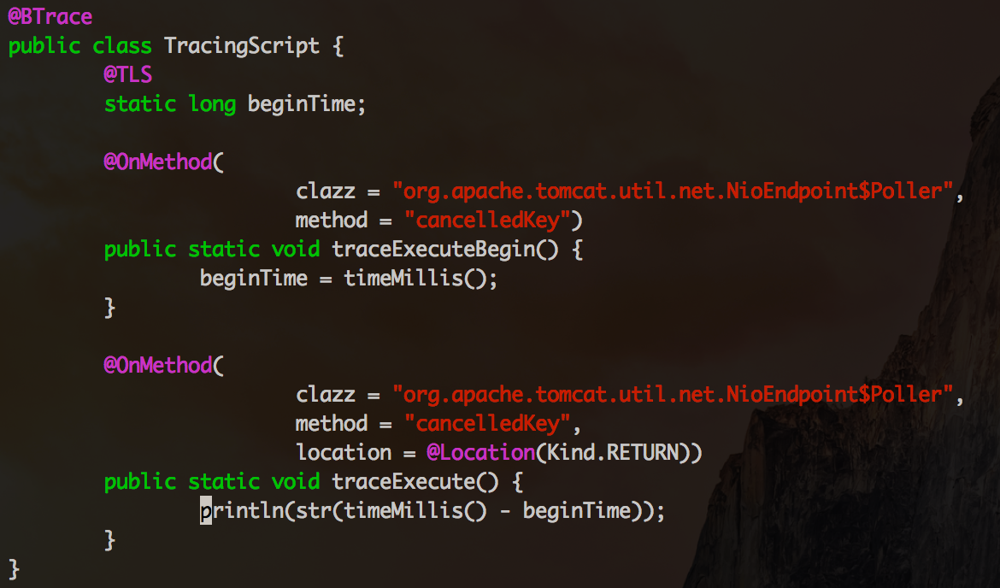

# 使用NIO时慎用SO_LINGER选项

前面写过一篇文章《TCP `SO_LINGER`选项对Socket.close的影响》，简单总结一下：

- **Socket.setSoLinger(false, linger)** ：socket主动调用close时会立即返回，操作系统会将残留在缓冲区中的数据发送到对端，并按照正常流程关闭(交换FIN-ACK），最后连接进入`TIME_WAIT`状态。
- **Socket.setSoLinger(true, 0)** ：主动调用close的一方也是立刻返回，但是这时TCP会丢弃发送缓冲中的数据，而且不是按照正常流程关闭连接（不发送FIN包），直接发送`RST`，对端会收到`java.net.SocketException: Connection reset`异常。
- **Socket.setSoLinger(true, linger > 0)** ：`SO_LINGER`选项生效，并且超时设置大于零，调用close的线程被阻塞，TCP会发送缓冲区中的残留数据，这时有两种可能的情况：
    1. 数据发送完毕，收到对方的ACK，然后进行连接的正常关闭（交换FIN-ACK）
    2. 超时，未发送完成的数据被丢弃，连接发送`RST`进行非正常关闭

文章最后提到在使用NIO时，最好不设置`SO_LINGER`。最近就遇到这样一个案例，服务端接收到请求创建新连接时，做了这样的设置：

```
SocketChannel.setOption(SocketOption.SO_LINGER, 1000)
```

这里有个很多人踩过的坑，`SO_LINGER`的单位为**秒**！在网络环境比较好的时候，例如客户端、服务器都部署在同一个机房，close虽然会被阻塞，但时间极短可以忽略。但当网络环境不那么好时，例如存在丢包、较长的网络延迟，问题就出现了：**close会被阻塞较长的时间，从而直接或间接引起NIO的IO线程被阻塞**，服务器失去响应，不能处理accept、read、write等任何IO事件。这个应用就是在内部使用一切正常，当对外部提供云服务时，频繁出现挂起现象。解决方法就是删掉这个设置，`close`时立即返回，由操作系统接手后面的工作。

我们可以借助Linux的流控工具`tc`模拟网络延迟和丢包，重现这个问题。

- 首先在服务器上安装`tomcat`，配置`NIO Connector`，设置`SO_LINGER`生效，超时时间1000秒：




- 客户端使用tc设置网络延迟400ms，丢包率 30%

```
tc qdisc add dev eth0 root netem delay 400ms  loss 30%
```

- 客户端启动ab进行压测

```
./ab -c25 -n10000 http://10.232.37.202:8080/docs/config/http.html
```

tomcat很快就被挂起，我们telnet到服务器的监听端口执行`GET /`，发现已经收不到响应。这时我们观察一下服务器的内部状况。

`netstat`检查网络状况，很多连接处在`FIN_WAIT1`状态，同时发送队列还有数据。由于网络状况较差，连接可能在`FIN_WAIT1`停留较长时间，调用`close`的线程需要等待缓冲区中的数据发送完成，然后连接交换FIN-ACK正常关闭。`SO_LINGER`的超时设置成了1000秒，基本不会出现超时，只能在这儿死等。




`jstack`检查线程状态，发现NIO的IO线程都被blocked




查找其中一个IO线程等待的锁，发现锁是被HTTP线程持有。这个线程正在执行`preClose0`，猜测就是在这里等待连接的关闭。




用btrace测量一下连接关闭的耗时：




发现很多时候要等待几秒。

```
5198
0
5250
0
2827
0
6324
0
6354
0
2822
1
2422
0
2826
0
2827
0
3231
3231
```

每次HTTP线程在关闭连接被阻塞时，同时持有了`SocketChannelImpl`的对象锁，而IO线程在把这个连接移除出它的`selector`管理队列时，也要获得同一个`SocketChannelImpl`的对象锁。IO线程就这么一次次的被阻塞，悲剧的无以复加。有些NIO框架会让IO线程去做close，这时候就更加悲剧了。

测试完了，移除tc的设置：

```
tc qdisc del dev eth0 root
```

至此，我们搞清楚了为什么在使用NIO时，建议不要设置`SO_LINGER`选项。那位同学说了，设置`SO_LINGER`就是为了等待数据真正被发送，放到OS的缓冲区，这时候重启了怎么办，我都不知道数据到底有没有成功发送。这还真是个有些复杂的问题，看看这个案例：[用TCP从一端向另一端发送未知大小的数据](http://t.cn/zj6AnK4)。貌似很简单的需求吧，却会遇到很多坑：`SO_LINGER`设置的影响；[接收缓冲区还有数据，close时发RST代替FIN](http://t.cn/aNjAgB)。一句话：TCP不那么“可靠”，还是要设计好应用层协议，例如加上`length`、`checksum`和`应用层ACK`。


