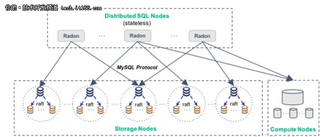

# 从RadonDB看新型数据库中间件的特性

现在新出现的MySQL中间件除了基本的数据sharding功能，都增加了很多高级特性，我觉得有三个特性比较重要：

* 分布式事务的支持
* 数据的强一致复制，提高了数据的安全性和可用性
* 支持跨shard join

通过对这些特性的支持，MySQL中间件具备了一些newSQL数据库的能力，不再是个纯粹的中间件，让用户更容易使用。我调研了最近开源的青云[RadonDB](http://radondb.io/)，希望了解下这方面最新的进展。

先简单看下`RadonDB`的整体架构：存储/计算分离。存储节点是`MySQL`，3个一组用`raft`实现数据的强一致性，不再是异步/半同步复制，数据的安全性、可用性级别更高。上层是`SQL节点`，负责客户端连接、SQL语句的解析和执行、分布式事务协调、数据sharding逻辑等。右下脚`计算节点`的作用，后面会解释。

在知乎上看到[<如何评价青云开源的分布式数据库 radondb>](https://www.zhihu.com/question/276564413)，`RandoDB`被吐槽的很厉害。我们从这些吐槽可以了解产品宣传之外的一些信息，知道做这种中间件不是那么容易。大家对`RandoDB`的几个关键特性的实现方式都不太满意。让我们逐一看看。

* **分布式事务的实现**

对分布式事务的实现大家吐槽的最厉害：

>官方宣传用XA实现了Snapshot Isolation，然而众所周知XA是无法实现SI的。所谓的事务其实只支持单条SQL，BEGIN / SET AUTOCOMMIT=0 都不支持。
>
>单语句事务，就是不能 begin 开启事务。
>
>为了达到 SI 隔离级别，在执行用户 SQL 时，会加上一个 commitLock，防止其他事务提交。这决定了加锁必须时间很短，比如一条SQL，如果你从start transaction开始加锁，那其他事务全都无法提交了，系统事实上已经不可用。
>
>所谓分布式事物快照隔离级别是 radondb 层 query 和 commit 语句串行化实现的。这个应该是串行化隔离级别了。而且是和冲突没关系的串行化，就是说根本不管两个事物之间有没有冲突数据。性能自行脑补。
>
>没有 XA log 的 XA 事务原子性实现都是耍流氓。
>

为什么*XA是无法实现SI*？ 我的理解是，单个MySQL实例虽然实现了`MVCC`，但它没有将底层`K/V`带有时间戳的版本信息暴露出来。也就是说，多个MySQL实例组成的集群没有全局的`MVCC`，每个实例内部的`MVCC`是独立的，无法得到全局一致性快照。XA事务跨越了多个节点，所以没办法实现`Snapshot隔离级别`。可以对比下`TiDB`的实现，底层`TiKV`是一个整体，有全局的`MVCC`，所以能在上层支持分布式事务的`Snapshot隔离级别`。

`RandoDB`的实现能work，但相当于在Proxy层将所有事务串行化，即使两个事务之间没有数据冲突。而且只有单语句事务。

对于XA log，开发者的解释是：

>proxy xa log只针对xa commit出错，目前通过分析log然后人工介入，这里没有再记log的必要

我觉得这么做很不严谨。2PC协议有一个问题，一旦事务参与者投票，它必须等待coordinator给出指示，提交或放弃。如果这时coordinator挂了，事务参与者除了等待什么也做不了。事务处于未决状态，事务的最终结果记录在coordinator的事务日志中，只能等它recovery。因此，现在很多改进的做法是用`Paxos/raft`保证事务日志的高可用，coordinator挂了可以快速切换。即使不用`raft`，找一个地方可靠持久的保存事务日志是非常必要的。

* **使用Raft保证强一致性**

现在很多项目都会使用`Paxos/Raft`来改进MySQL的复制机制，实现数据的强一致性。如果主、备间任何时刻都完全一致，那么任何时刻都可以安全的进行主备切换。如果无法保证主、备间的强一致性，那么当有持续不断的更新时，主备切换就无法保证强一致性，需要在切换时暂停主库的写入，服务会有短暂的中断。

腾讯的[PhxSQL](https://github.com/Tencent/phxsql)就是建立在`Paxos`的一致性和MySQL的`binlog`流水基础上，通过`Paxos`保证强一致和高可用的MySQL集群。关于PhxSQL的设计理念可以参见：

* [谈谈PhxSQL的设计和实现哲学（上）](https://mp.weixin.qq.com/s/Qz2R4oTqWk3SmhuHCQOleQ)
* [谈谈PhxSQL的设计和实现哲学（下）](https://mp.weixin.qq.com/s/M2h6v7MuYEnbktVb8VswZw)

采用类似做法的还有阿里云的[MySQL金融版](https://help.aliyun.com/document_detail/51701.htm)。另外，MySQL官方也从5.7开始推出了[Group Replication](https://dev.mysql.com/doc/refman/5.7/en/group-replication.html)机制，内部使用`Paxos`实现了多个副本的一致。

`RadonDB`的实现机制和[PhxSQL](https://github.com/Tencent/phxsql)不太一样。它在一组MySQL集群内的复制还是通过`Semi-Sync`机制（Semi-Sync设置为无限大，不退化为异步复制），保证有一个`slave`和`master`完全一致。主备切换时会选择这个`slave`为主，然后结合MySQL的 `Multi-threaded replication` 和 [GTID机制](https://dev.mysql.com/doc/refman/5.7/en/replication-gtids.html) 进行快速回放，让主备重新一致。`Raft`用在哪里了？在 `RadonDB` 只使用 `Raft` 进行选主，当主挂掉之后，使用 `Raft` 选出新的主。`Raft`选主的逻辑是选出一个拥有最多的`committed log`的成员作为主，那么对于`RadonDB`来说，哪个MySQL的`GTID`最大就选哪个。

我自己还没有使用`Raft`的经验，不确定`RadonDB`的实现机制是否合理。但利用`Semi-Sync`模拟同步复制的方案，我觉得有一个地方不妥。当和主库保持强同步的备库有问题时，这组MySQL整体就不可用，因为它需要至少一个备库和主库完全一致，这就因为单点降低了整个集群的可用性。如果是用`Raft`做数据复制，就不会有这种单点影响全局可用性的问题。

另外，`RandoDB`被吐槽 `Raft` 的实现业余、不严谨：

>打开用来做HA的Xenon模块，一看又是作业级的肯写代码不肯写测试的raft练手实现。raft测试用例一共1500行[go代码](https://github.com/radondb/xenon/blob/master/src/raft/raft_test.go)
>刚才数了下，自己的raft库光election相关的单元测试用例就数千行代码了。做生产环境用的系统不是练手写作业，需要一个go的raft库，既然都不肯写完备的测试了，那就老老实实用etcd或者hashicorp的raft。自己私下撸一个raft库练手，和给自己全职项目选一个可靠的raft实现，两者真的不矛盾。最滑稽，只做选主干嘛自己撸一个raft实现？

* **join等复杂查询的实现**

严格说`RandoDB`是不支持join的。它的做法是让`计算节点`通过`binglog`复制了全量数据，`SQL节点`会把join等复杂查处路由到`计算节点`执行。

> “计算节点”使用tokudb存储引擎存储全量数据，为了支持复杂查询。。。如果我一个分布式系统的数据总量有20T、100T，也用单个“计算节点”存储全量数据？而且这个数据同步过程是异步的，显然没法用在OLTP场景。
> 

通过一些实用的方式支持了Join，这种做法可以work，但`RandoDB`离它宣称的数据库还差很远，缺少全局的执行计划优化。

总体来说，`RandoDB`的理想很宏大，用实用的方案解决了一些问题，但要成为真正成熟的数据库产品还差的比较远。`RadonDB` 的核心代码1万行左右。加上其它类库引入，`Radon`代码11万+， `Xenon`代码5万行+ 。

最后，看到有人推荐腾讯的[TDSQL](http://tdsql.org/)，也顺便了解了一下。从资料看[TDSQL](http://tdsql.org/)很不错，可惜不是开源产品。除了水平扩张、安全增强、自动化运维以外，它具备了我们上面提到的数据库中间件的高级特性：

* 支持分布式事务`XA`
    * 全局事务的隔离级别最高可以达到`serializable`级别
    * 分布式事务对业务透明，兼容单机事务语法
    * 允许事务中多条语句分别发给多个分片
    * 支持`autocommit`下单条语句写访问多个分片
* 默认采用**强同步复制**，即主从节点数据完全一致
* 复杂查询方面
    * 允许以流式处理方式运行`group by`、`order by`
    * 支持两个`Shard`使用`shardkey`（分表键）做等值连接，以及使用`shardkey`的子查询

支持了部分受限的复杂查询，对于数据库中间件来说已经算比较强大了。关于`TDSQL`的分布式事务，可以通过这两篇进行更多的了解：

* [一文教你迅速解决分布式事务 XA 一致性问题](https://cloud.tencent.com/developer/article/1005840)
* [鹅厂 TDSQL XA 事务隔离级别的奥秘](https://cloud.tencent.com/developer/article/1005380)

如果我们做MySQL中间件，可以瞄准`TDSQL`，对于分布式事务、数据强一致性，以及复杂查询、跨shard join 等特性都要考虑支持。

