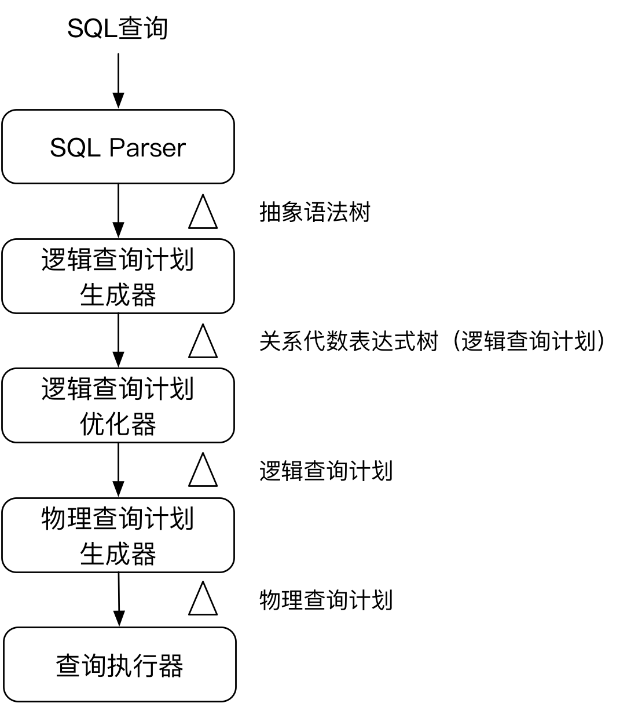
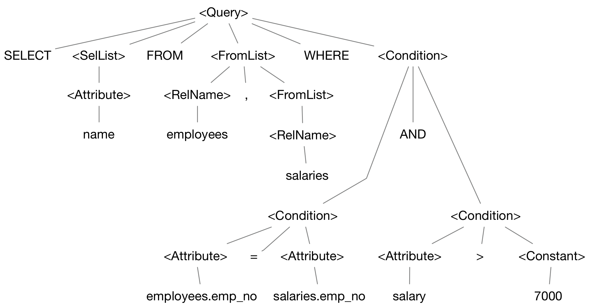
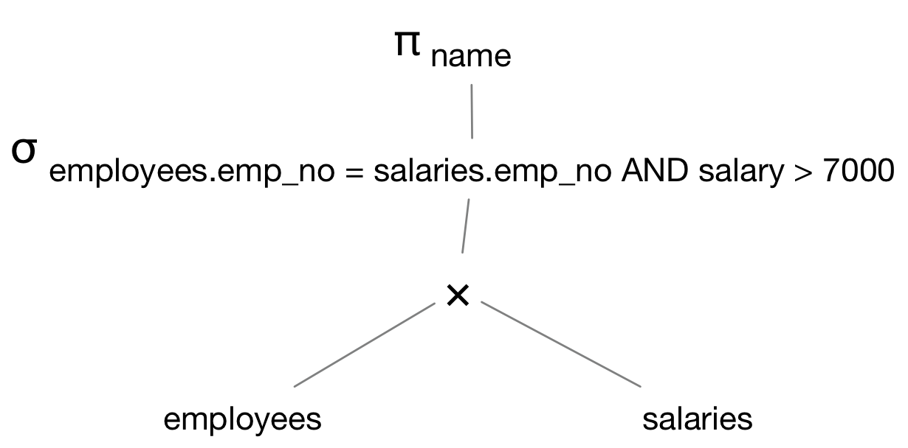
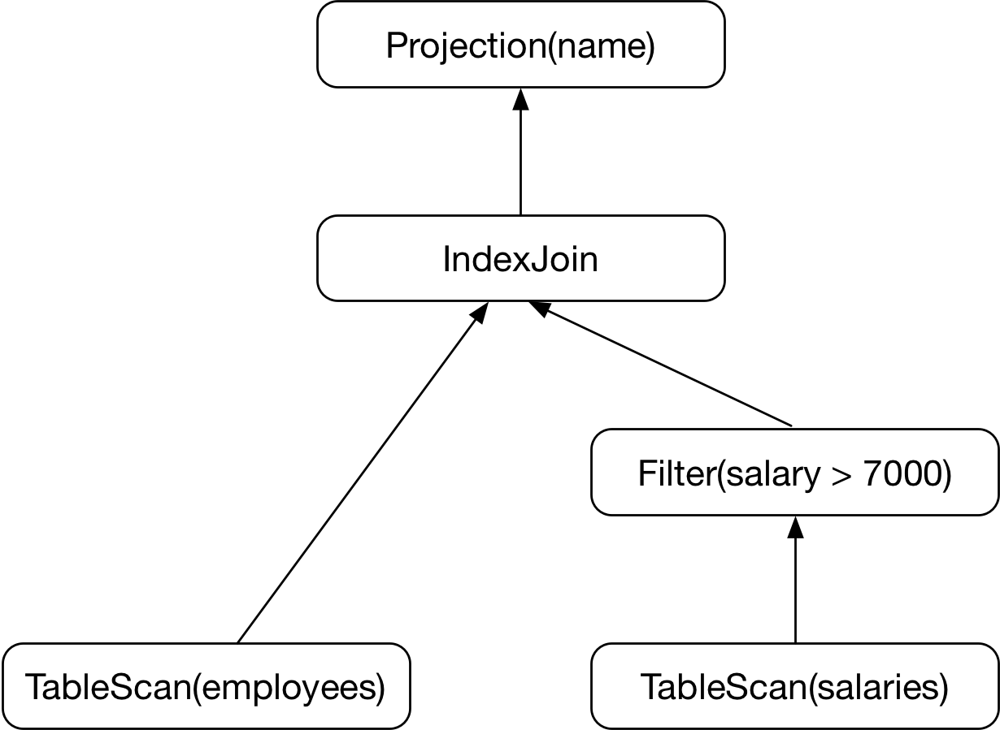

# 关系数据库查询处理基础知识扫盲

当[TiDB 源码阅读系列](https://pingcap.com/blog-cn/#%E6%BA%90%E7%A0%81%E9%98%85%E8%AF%BB)更新到第六篇[《Select 语句概览》](https://pingcap.com/blog-cn/tidb-source-code-reading-6/)时，我发现需要一些关系数据库的基础知识才能更好的理解，例如逻辑查询计划优化其实就是：使用**代数定律**对查询语句的**代数表达式树**做等价转换，使改进后的**代数表达式树**预期可以生成更有效的**物理查询计划**。有了这些基础知识，看代码才能做到知其然知其所以然。本文希望通过梳理关系数据库背后的知识，为读懂 `TiDB` 查询处理器部分的源码扫清障碍。


## 极简数据库发展史

数据库的应用及其广泛，已经成为信息系统的核心技术和重要的基础设施。简单说数据库需要做两件事：存储数据，以及随后在你需要的时候能访问读取数据。

最早的数据库是基于**文件系统**，虽然它满足了长期存储数据的需求，但没有提供对文件的查询语言，读取访问非常不便利。于是人们在文件系统上引入一层抽象：**数据模型**。数据模型是对现实世界数据特征的抽象，能比较真实地模拟现实世界，容易为人所理解，也便于在计算机上实现。

最早出现的是**层次模型**（[Hierarchical Model](https://en.wikipedia.org/wiki/Network_model)），数据被组织为一棵树，类似于今天**文档数据库**使用的`JSON`的结构。**层次模型**很适合处理**one-to-many**关系，但要表现**many-to-many**关系则非常困难，一般也不支持`join`。使用**层次模型**最著名的数据库是 `IBM` 的**Information Management System (IMS)**，它最初是为了解决阿波罗飞船登月计划的需求，协调分散在全球制造的200万个阿波罗飞船零部件的生产进度。

随后出现了不同的方案解决**层次模型**的限制，其中最突出的两个模型是**网络模型**（[Network Model](https://en.wikipedia.org/wiki/Network_model)）和**关系数据模型**，最终关系数据模型胜出。

今天最著名和使用最广泛的数据模型是由 [Edgar Codd](https://en.wikipedia.org/wiki/Edgar_F._Codd) 博士提出的**关系数据模型**，他在1970年发布的论文[《A Relational Model of Data for Large Shared Data Banks》](http://www.seas.upenn.edu/~zives/03f/cis550/codd.pdf)，奠定了关系数据库的理论基础。ACM在1983年把这篇论文列为从1958年以来的四分之一世纪中具有里程碑式意义的最重要的25篇研究论文之一。到了80年代中期，基于关系数据模型的**关系数据库**已经成为人们存储、查询结构化数据的首选工具。

到了2010年，**NoSQL**兴起，试图颠覆**关系数据模型**的统治地位。随着互联网的爆发式发展，数据库领域又一次发生了摇摆，伴随着互联网的特殊需求，一批有着新鲜血液的 **NoSQL** 数据库涌现了出来，**层次模型**又重新站在了大家面前。**NoSQL**为了应对海量数据存储和高并发访问，决定放弃**关系数据模型**和**事务**等关系数据数据库的关键特性。自从 **NoSQL** 概念横空出世，关系数据库似乎成了低效、高成本、速度慢的数据处理模式的代名词。然而，**NoSQL**在解决问题的同时也给使用者带来了很多困扰， **最终一致**让应用开发者要面对各种复杂的场景。

数据库技术的发展是螺旋式上升，Google发布的`Spanner`和`F1`两篇论文，让人们看到了**关系数据模型** 和 **NoSQL** 融合的可能性。以 [TiDB](https://github.com/pingcap/tidb) 为代表的 **NewSQL** 数据库，让人们重新享受关系模型、强一致性事务等对使用者友好的特性，同时也具备了 **NoSQL** 的水平扩展能力。

## 关系数据模型 和 关系代数

**数据模型**是对现实世界事物的抽象，而**关系数据模型**将一切事物都抽象为**关系**，并通过集合运算的方式规定了关系之间的运算过程，模型相对的比较简单，数据证明严谨，因此很快被大家广泛接受。

这一节我将介绍关系数据库的数学基础：**关系数据模型**和**关系代数**。

### 关系数据模型

关系模型为人们提供了一种描述数据的方法：一个称为**关系**（relation）的二维表。现实世界的实体以及实体间的各种联系都可以用**关系**来表示。我们通过例子来了解关系模型的重要术语：

**雇员表**

| emp_no | name | birth_date | gender | hire_date | 
| --- | --- | --- | --- | --- | 
| 1 | 汤唯 | 1990-06-08 | 女 | 2015-08-01 | 
| 2 | 刘亦菲 | 1994-09-10 | 女 | 2017-05-06 | 
| 3 | 刘德华 | 1986-04-18 | 男 | 2008-09-01 | 
| ... | ... | ... | ... | ... | 

* **关系（Relation）** ：一个关系对应通常说的一张二维表
* **元组（Tuple）** ： 表中的一行即为一个元组
* **属性（Attribute）** ：表中的一列即为一个**属性**，给每一个属性起一个名称即**属性名**
* **键（Key）**：表中的某个属性组，它可以唯一确定一个元组
* **域（Domain）** : 是一组具有相同数据类型的值的集合。属性的取值范围来自某个域。例如性别的域是（男，女）。
* **关系模式（schema）**：对关系的描述，先给出一个关系名，其后是用圆括号扩起来的所有属性，例如：`employees（emp_no, name, birth_date, gender, hire_date）`

### 关系代数

一门**代数**是由一些**操作符**和**操作数**组成。例如算术代数的加、减、乘、除是操作符，变量`x`和常量`8`是操作数。任何一门代数都允许把操作符作用在操作数上构造出**表达式（expression）**，例如算术表达式 `(x+y)*3`。

**关系代数** 也是一门代数，它的操作数是**关系**，操作运算符有两类：**集合运算符**和专门的**关系运算符**。

**关系代数**可以认为是一种抽象的查询语言，利用对**关系**的**运算**来表达**查询**，运算对象是**关系**，运算结果也是**关系**。因此，**关系代数**的表达式也被称为**查询（query）**。

#### 传统的集合运算

三个最常见的集合操作是：**并**（union）、**交**（intersection）、**差**（difference）。

* `R ∪ S`，表示关系R和S的**并**，得到的结果关系的元素来自R或者S，或R和S中都出现过。
* `R ∩ S`，表示关系R和S的**交**，同时在R和S中存在的元素集合。
* `R - S`，表示关系R和S的**差**，它是由在R中出现但不在S中出现的元素构成的集合。

另外一个集合操作是**笛卡尔积**（Cartesian Product）。

* 关系R和S的**笛卡尔积**是一个有序对的集合，有序对的一个元素是关系R中的任何一个元组，第二个元素是关系S中的任何一个元组表示为 `R × S`。

关系R

| A | B |
| --- | --- |
| 1  | 2 |
| 3 | 4 |  

关系S

| B | C | D |
| --- | --- | --- |
| 2 | 5 | 6 |
| 4 | 7 | 8 |
| 9 | 10 | 11 |

`R × S`的结果

| A | R.B | S.B | C | D |
| --- | --- | --- | --- | --- |
| 1 | 2 | 2 | 5 | 6 |
| 1 | 2 | 4 | 7 | 8 |
| 1 | 2 | 9 | 10 | 11 |
| 3 | 4 | 2 | 5 | 6 |
| 3 | 4 | 4 | 7 | 8 |
| 3 | 4 | 9 | 10 | 11 |

#### 专门的关系运算

* **选择**（selection)，当**选择**操作符应用到关系`R`上时，产生一个关系R的元组的子集合。结果关系元组必须满足某个涉及`R`中属性的条件`C`，表示为 $$σ_C( R )$$
* **投影** （projection），用来从一个关系生成一个新的关系，这个关系只包含原来关系`R`中的部分列。表达式 $$ π_{A1},_{A2},...,_{An} ( R )$$ 的值是这样一个关系，它只包含关系`R`属性`A1,A2,...An`所代表的列。

* **θ连接**，关系R和关系S满足条件C的**θ连接**可以用这样的符号来表示： $$ R ⋈_C S $$ 

**θ连接**的结果这样构造：

1. 先得到R和S的**笛卡尔积**
2. 在得到的关系中寻找满足条件`C`的元组

关系R

| A  | B | C |
| --- | --- | --- |
| 1 | 2 | 3 |
| 6 | 7 | 8 |
| 9 | 7 | 8 |

关系S

| B  | C | D |
| --- | --- | --- |
| 2 | 3 | 4 |
| 2 | 3 | 5 |
| 7 | 8 | 10 |

$$ R ⋈ _{ A<D \, AND \, R.B ≠ S.B} S $$ 的结果是：


| A | R.B | R.C | S.B | S.C | D |
| --- | --- | --- | --- | --- | --- |
| 1 | 2 | 3 | 7 | 8 | 10 |

有两类常用的连接运算：

1. **等值连接**（equijoin）：比较运算符为 `=` 的连接运算称为等值连接。例如： $$ R ⋈ _{ R.A = S.B } S $$ 从关系R与S的笛卡尔积中选取A、B属性值相等的那些元组。
2. **自然连接**（Natural join）：自然连接是一种特殊的等值连接，两个关系中进行比较的分量必须是相同的属性组，并在结果中把重复的属性列去掉。关系R和S的自然连接表示为  `R ⋈ S`

关系R

| A | B |
| --- | --- |
| 1  | 2 |
| 3 | 4 |  

关系S

| B | C | D |
| --- | --- | --- |
| 2 | 5 | 6 |
| 4 | 7 | 8 |
| 9 | 10 | 11 |

`R ⋈ S`

| A  | B | C | D |
| --- | --- | --- | --- |
| 1 | 2 | 5 | 6 |
| 3 | 4 | 7 | 8 |

两个关系R和S在做**自然连接**时，如果一个元组不能和另外关系中的任何一个元组配对的话，这个元组被称为**悬浮元组**（Dangling tuple）。上面的例子中，关系S的第三个元组就是悬浮元组。

如果把**悬浮元组**也保存在结果关系中，而在其他属性上填**空值**(Null)，就叫做**外连接**（Outer Join）。

1. **左外连接**(LEFT OUTER JOIN或LEFT JOIN)：只保留左边关系`R`中的悬浮元组
2. **右外连接**(RIGHT OUTER JOIN或RIGHT JOIN)：只保留右边关系`S`中的悬浮元组

#### 关系代数的扩展操作符

* **消除重复操作符**（duplicated-elimination operator）用 `δ(R)` 来返回一个没有重复元组的关系`R`
* **聚集操作符** （aggregation operator）用来汇总或者聚集关系某一列中出现的值，有 `SUM`，`AVG`，`MIN`，`MAX`，`COUNT` 等
* **分组操作**（grouping）根据元组在一个或多个属性上的值把关系的元组拆成“组”。这样聚集操作就可以对分组的各个列进行计算。分组操作符 `γ` 是组合了**分组**和**聚合操作**的一个算子。例如表达式： $$ γ_{gender, \, COUNT(emp_-no)->count}(employees) $$ 代表把性别（gender）作为分组属性，然后对每一个分组进行`COUNT(emp_no)`的操作。
* **排序算子**（sorting operator）如果关系`R`的模式是 `R(A,B,C)`，那么 τ<sub>C</sub>( R ) 就把`R`中的元组按照属性`C`的值排序。


### 关系代数小结

上面的知识有些枯燥，但非常容易理解，因为我们经常使用关系数据库，已经接受了这些概念。掌握了一些关系代数的知识，在阅读`TiDB`源码时，当看到`selection`、`projection` 这些术语就能一下想到它们对应的关系代数运算符。

这里只介绍了关系代数最基本的概念，如果想完整学习，建议参考斯坦福大学大学的课程[CS145: A First Course in Database Systems](http://infolab.stanford.edu/~ullman/fcdb.html)，对应的教材有中文版[《数据库系统基础教程》](https://book.douban.com/subject/3923575/)。

其实我们在查询时提交给数据库的就是**关系代数表达式**，它是关系运算符的组合，数据库会根据一些**代数定律**对最初的表达式做等价变换，得出一个最优的**等价表达式**（equivalent expression），即可以更快的被计算出结果的表达式。这个过程就是**逻辑查询计划优化**，后面我会简单的介绍相关概念。

## SQL 的诞生

**SQL**(Structured Query Language) 结构化查询语言，是关系数据库的标准语言。

在1970年Codd博士提出了关系模型之后，由于**关系代数**或者**关系**都太数学了，难以被普通用户接受。IBM在研制关系数据库管理系统原型`System R`的过程中，决定摈弃数学语言，以自然语言为方向，结果诞生了结构化英语查询语言（`Structured English Query Language`，`SEQUEL`），后来更名为**SQL**。`System R` 因此获得1988年度ACM“软件系统奖”。
 
**SQL**是声明式查询语言，你只需要指定想要获得什么样的数据，而无须了解如何实现这个目标。**SQL**具体是如何执行的，取决于数据库系统的**查询处理器**，它来决定哪些索引和哪些连接方法可以使用，以及以什么样的顺序执行查询的各个部分。**SQL**隐藏了数据库引擎的实现细节，因此用户可以在不修改查询语句的情况下，享受到数据库性能优化带来的好处。

下面我们来看看数据库的查询处理器。

## 关系数据库的查询处理器

**SQL**是在很高层次上表达查询，那么数据库的**查询处理器**必须提供查询被如何执行的大量细节。下面我从概念上介绍查询处理器的处理流程，实际的数据库实现要复杂的多，特别是像 `TiDB` 这样的分布式数据库。如果想比较系统的了解数据库的实现技术，同样推荐斯坦福大学计算机科学专业的课程 [CS245: Database System Implementation](http://infolab.stanford.edu/~ullman/dbsi.html)。上面提到的[CS145](http://infolab.stanford.edu/~ullman/fcdb.html)是[CS245](http://infolab.stanford.edu/~ullman/dbsi.html)的预修课。国内很少有讲数据库内部实现的书，这门课的教材值得阅读。当然最好的学习方法是理论联系实践，多去读 [TiDB](https://github.com/pingcap/tidb) 的源代码:)

一般查询处理可以简单的划分为以下几个步骤：



1. 对SQL进行语法分析，将查询语句转换成**抽象语法树**。
2. 把**抽象语法树**转换成**关系代数表达式树**，这就是初始的**逻辑查询计划**。
3. 使用**关系代数**中的多个**代数定律**改进初始的**代数表达式树**。利用一些**代数定律**，可以把**代数表达式树**转换成一个**等价**的表达式树，后者预期可以生成更有效的**物理查询计划**。这一步进行了查询重写，可以称为**逻辑查询计划优化**。
4. 为**逻辑查询计划**的每一个操作符选择实现算法，并确定这些操作符的执行顺序，**逻辑查询计划**被转化为**物理查询计划**。**物理查询计划**指明了要执行的操作，操作的执行顺序，执行每步所用的算法，获取数据的方式，以及数据从一个操作传递给另一个操作的方式。

### 查询示例

本文准备以一个简单的例子来介绍查询处理的流程，下面是查询涉及的两张表：

**employees**

| emp_no | name | birth_date | gender | hire_date | 
| --- | --- | --- | --- | --- | 
| 1 | 汤唯 | 1990-06-08 | 女 | 2015-08-01 | 
| 2 | 刘亦菲 | 1994-09-10 | 女 | 2017-05-06 | 
| 3 | 刘德华 | 1986-04-18 | 男 | 2008-09-01 | 
| ... | ... | ... | ... | ... | 

**salaries**

| emp_no | salary | last_modified |
| --- | --- | --- |
| 1 | 8000 | 2018-04-01 |
| 2 | 6000 | 2018-04-01 |
| 3 | 15000 | 2018-04-01 |
| ... | ... | ... |

想要获取工资大于7000的员工姓名列表，SQL语句可以这么写：

```
SELECT name
FROM employees, salaries
WHERE employees.emp_no = salaries.emp_no AND
      salary > 7000;
```


### SQL 语法分析

`SQL Parser`的功能是把SQL语句按照SQL语法规则进行解析，将文本转换成**抽象语法树**（AST）。具体的实现可以参考这篇文章[《TiDB SQL Parser 的实现》](https://github.com/mz1999/Apusic-db-team/blob/master/docs/sql-parser.md)。 示例SQL解析完成后得到下面的语法树：




### 生成逻辑查询计划

现在将上一步生成的语法树转换成**关系代数表达式树**，也就是**逻辑查询计划**。对于示例SQL的抽象语法树转换过程如下：

* `<FromList>` 中涉及的关系`employees`和`salaries`做笛卡尔积运算
*  选择（selection）运算 σ<sub>C</sub>，其中`C`被替换成`<Condition>`表达式，即`employees.emp_no = salaries.emp_no AND salary > 7000`
*  投影（projection） π<sub>L</sub>，其中`L`是`<SelList>`中的属性列表，对于这个查询只有一个属性`name`

我们得到下面的关系代数表达式树：




### 逻辑查询计划的改进

当我们把查询语句转换成关系代数表达式时，得到了一个初始的**逻辑查询计划**。现在我们可以使用关系代数中的多个**代数定律**改进**逻辑查询计划**。

这里仅仅列出一小部分这样的**代数定律**，它们可以将一个表达式树转换成一个**等价**的表达式树。

* 交换律和结合律

```
R × S = S × R; (R X S) × T = R × (S × T)
R ⋈ S = S ⋈ R; (R ⋈ S) ⋈ T = R ⋈ (S ⋈ T)
R ∪ S = S ∪ R; (R ∪ S) ∪ T = R ∪ (S ∪ T)
R ∩ S = S ∩ R; (R ∩ S) ∩ T = R ∩ (S ∩ T)
```

* 涉及选择的定律

$$ σ_{C1}\,_{AND}\,_{C2} = σ_{C1}(σ_{C2}( R ))$$
$$ σ_{C1}\,_{OR}\,_{C2} = (σ_{C1}( R )\,∪\,(σ_{C2}( R ) )$$
$$ σ_{C1}(σ_{C2}( R )) = σ_{C2}(σ_{C1}( R )) $$

* 下推选择

在表达式中下推选择是查询优化器最强有力的工具。

$$ σ_C( R × S ) = σ_C( R ) × S $$
$$ σ_C( R ⋈ S) = σ_C( R ) ⋈ S $$
$$ σ_C( R ⋈_{D} S) = σ_C( R ) ⋈_D S $$

* 涉及连接和笛卡尔积的定律

$$ R ⋈_C S = σ_C( R × S) $$

* 涉及消除重复的定律

$$ δ(R×S) = δ( R ) × δ(S)$$
$$ δ(R⋈_CS) = δ( R ) ⋈_C δ(S)$$

另外还有涉及投影的定律、涉及分组和聚集的定律。这部分有些理论化，可以参考这篇[《TiDB 源码阅读系列文章（七）基于规则的优化》](https://pingcap.com/blog-cn/tidb-source-code-reading-7/)看看 `TiDB` 具体是怎么做的。

对于本例使用到的定律比较简单。先将选择的两部分分解为 σ<sub>employees.emp_no = salaries.emp_no</sub> 
和 σ<sub>salary > 7000</sub>，后者可以在树中下推。第一个条件涉及笛卡尔积两边的属性，可以把上面提到的定律

$$ R ⋈_C S = σ_C( R × S) $$

从右向左使用，把**笛卡尔积**转换成**连接**。使用了两个定律后，得到优化后的逻辑查询计划如下图：


### 物理查询计划的生成

这一步我们需要把**逻辑查询计划**转换成**物理查询计划**。通常由逻辑计划可以得到多个物理计划，我们需要对每个物理计划进行评估，选择具有最小估计代价的物理查询计划。

#### 基于代价的物理计划选择

在从逻辑计划构建物理计划的时候，因为可能得到多个物理计划，我们需要通过估计物理计划执行的代价来确定最优选择。

如何计算这个代价呢？我们可以用物理计划每一步的任务执行时发生的磁盘I/O数、网络吞吐量、占用的内存空间大小等近似估算。

这些资源的访问和占用，又是由什么决定的呢？可能包括的决定因素有：

* 参与运算任务执行的数据大小
* 数据的分布位置（连续的磁盘空间、离散的磁盘空间、网络节点等）
* 关系中属性的不同值的数目
* 属性值的最大值、最小值、以及值的分布情况

数据库会收集统计这些信息，用来估算具体任务的代价。

逻辑查询计划在转换成物理计划的时候，每一步的转换都会面临多种情况的选择，最容易想到的是使用穷举法，估算每一种情况的代价，最后确定最优的物理计划。但使用穷举法的话，很可能估算本身的代价变得非常大，实践中可以采用**动态规划**（dynamic programming）等算法。

#### 枚举物理查询计划

以上一步输出的逻辑查询计划为例，看看在枚举物理查询计划时需要做出哪些选择。

首先，逻辑查询计划的每个结点转换成什么样的物理运算符会遇到多种选择。我们从逻辑查询计划树自底往上来看：

* 逻辑计划的叶子结点

逻辑查询计划树的叶子结点被一个**扫描运算符**替代。这些运算符一般包括：

1. **TableScan( R )**：以任意顺序读人所有元组
2. **SortScan(R, L)**：按照顺序读入`R`的元组，并以列`L`中的属性进行排列
3. **IndexScan(R, C)**：`C`是一个带有比较运算符的条件，例如 `A = 100`，`A`是`R`的一个属性，如果`A`上建立的索引，可以通过索引来访问`R`的元组。如果比较运算符不是等值比较，则索引必须是一个支持范围查询的索引，例如`B+ Tree`
4. **IndexScan(R, A)**：这里`A`是`R`的一个属性，关系`R`通过`A`上的索引被检索。 如果`R`的数据在磁盘上不是占用连续的存储空间，该运算符可能比**TableScan**更有效。

* 逻辑计划的σ选择（selection)结点

`σ`选择结点一般有两种选择：

1. 可以简单的用物理过滤运算符`Filter( C )`替代 σ<sub>C</sub>( R ) 
2. 如果`C`是一个带有比较运算符的条件，例如 `A = 100`，并且属性`A`上有索引，可以把比较运算合并到**扫描运算符**：`IndexScan(R, A = 100)`。

对于本例，`salary` 一般都不会建立索引，因此可以把`σ( salary > 7000 )` 替换为 `Filter( salary > 7000 )`

* 逻辑计划的连接结点

常见的**等值连接**满足**结合律**和**交换律**，因此**连接**可以得到很多候选的物理执行计划。其中最关键的问题是确定连接顺序。

当两个关系连接，只有两种选择，一般我们应该将估计值较小的关系放在前面。当连接有2个以上关系时，可能的连接树的数量会迅速增加，例如4个关系的连接将会有`4!=24`种连接方式。这一部分很复杂，就不在本文讨论了。

除了连接顺序，还需要确定具体使用的连接算法。常见的算法有：

1. **nested loops**
2. **基于排序的join**（sort merge join）
3. **hash join**
4. **基于索引的join**

* 逻辑计划的投影结点

投影结点的任务比较明确，输出包含指定列的关系。

除了将逻辑查询计划的结点转换成物理运算符，在选择物理计划时还要考虑数据如何在运算符之间流动（中间结果保存到磁盘或流水线方式），物理运算符的执行顺序等。这些细节本文就不再讨论。

最后，假定我们在所有选择的组合中，确定了其中一个作为最优的物理查询计划，然后就可以把它交给查询执行器真正的执行了：




## 写在最后

本文把关系数据库查询处理涉及的基础知识进行了梳理，希望对你理解 `TiDB` 的代码能有所帮助。

数据库是一个非常迷人的领域，它有很强的理论基础，同时又涉及大量的工程实践，可以说是最复杂的系统软件之一。我相信能开发数据库是很多程序员的梦想。梦想还是要有的，让我们一起努力吧！


