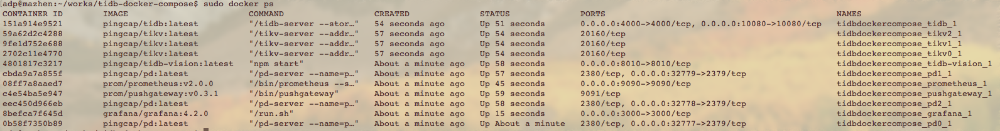
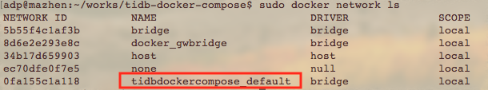

# 利用docker compose在单机上玩转TiDB

TiDB提供了`docker compose`的部署方式，可以很方便的在单机上搭建一个TiDB集群作为开发测试环境。如果修改了`TiDB`源码，可以使用这样方式，先在本机部署集群做一些验证。

* 首先本机要安装`docker`和`docker compose`，建议参考官方文档[Install Docker](https://docs.docker.com/engine/installation/) 和 [Install Docker Compose](https://docs.docker.com/compose/install/)

* 下载`tidb-docker-compose`项目

```
git clone https://github.com/pingcap/tidb-docker-compose.git
```

* 使用`docker compose`启动TiDB集群

```
cd tidb-docker-compose && sudo docker-compose up -d
```

就这么简单，集群启动成功了。使用`docker ps`查看：




可以看到，已经启动了三个`tikv`实例，一个`tidb`实例，三个`pd`实例，还有监控和`tidb-vision`。

监控的访问地址是 [http://localhost:3000](http://localhost:3000)，用户名/密码：admin/admin。

tidb-vision 的访问地址是 [http://localhost:8010](http://localhost:8010)

* 使用`MySQL`客户端访问`TiDB`

如果本机有`MySQL`客户端，可以直接连接：

```
mysql -h 127.0.0.1 -P 4000 -u root
```

如果本机没有`MySQL`客户端，可以使用docker启动一个`MySQL`容器，然后登录到容器内，再使用`MySQL`客户端连接`TiDB`集群。这种方式比较环保，只要有docker环境就行。先查看`TiDB`集群的`docker`网络：




然后启动MySQL容器，注意要加入`TiDB`集群的`docker`网络：

```
sudo docker run --network=tidbdockercompose_default --rm -it mysql /bin/bash
```

因为和`TiDB`集群在同一个docker网络，在MySQL容器内，可以使用`tidb`名称访问到`TiDB`：

```
mysql -h tidb -P 4000 -u root
```

* 停止集群

```
sudo docker-compose down
```


如果自己build了`TiDB`版本想在本机run集群，[文档](https://github.com/pingcap/tidb-docker-compose)写的很清楚，告诉你镜像应该放在什么位置。

Have fun!


