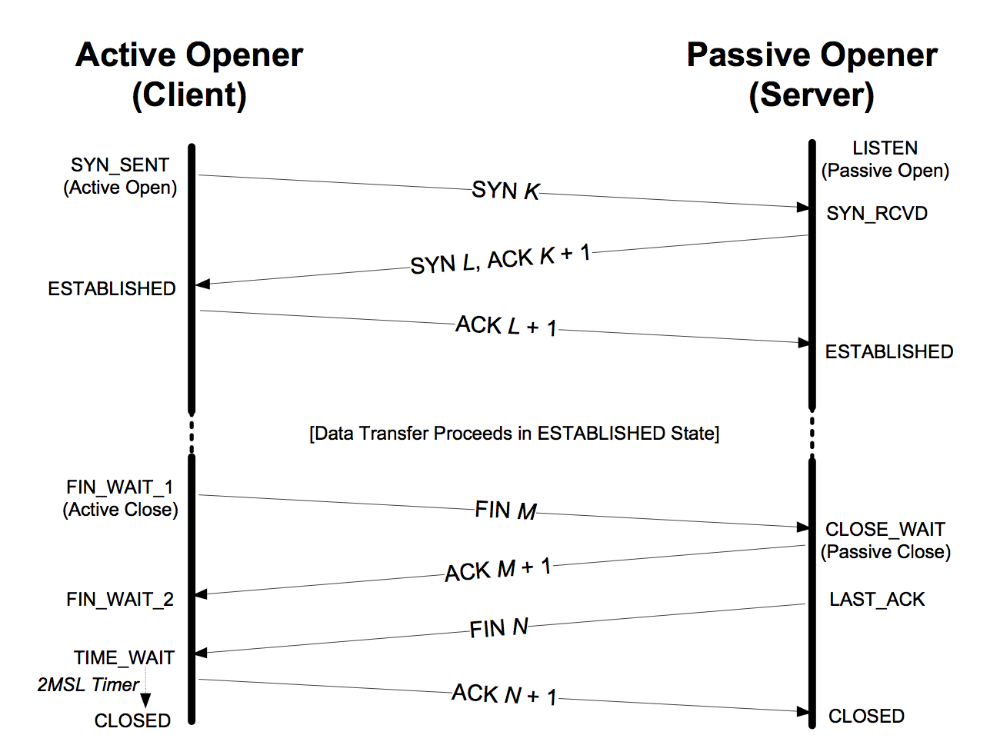

# 应用关闭后占用端口时间过长的问题

早上毕玄转给我一个问题，vsearch在上海机房部署的应用，在应用关闭后，端口释放的时间要比杭州机房的时间长。

TCP的基本知识，主动关闭连接的一方会处于`TIME_WAIT`状态，并停留两倍的`MSL`（Maximum segment lifetime）时长。

那就检查一下MSL的设置。网上有很多文章说，可以通过设置`net.ipv4.tcp_fin_timeout`来控制MSL。其实这有点误导人。查看[Linux kernel的文档](https://www.kernel.org/doc/Documentation/networking/ip-sysctl.txt) ，发现tcp_fin_timeout是指停留在FIN_WAIT_2状态的时间：

> tcp_fin_timeout - INTEGER
The length of time an orphaned (no longer referenced by any application) connection will remain in the FIN_WAIT_2 state before it is aborted at the local end.  While a perfectly valid "receive only" state for an un-orphaned connection, an orphaned connection in FIN_WAIT_2 state could otherwise wait forever for the remote to close its end of the connection. Default: 60 seconds

幸好这个问题原先在内部请教过：

> sysctl调节不了，只能调节复用和回收。
以前改小是改下面文件，重新编译内核的。
grep -i timewait_len /usr/src/kernels/2.6.32-220.el6.x86_64/include/net/tcp.h
define TCP_TIMEWAIT_LEN (60HZ) / how long to wait to destroy TIME-WAIT
define TCP_FIN_TIMEOUT TCP_TIMEWAIT_LEN

而阿里内核支持修改`TIME_WAIT`时间：

    net.ipv4.tcp_tw_timeout
    
然后找了两台机器做对比，用`sysctl`命令查看。杭州机房的机器：

    sudo sysctl -a | grep net.ipv4.tcp_tw_timeout
    net.ipv4.tcp_tw_timeout = 3
    
上海机房的机器：

    $sudo sysctl -a | grep net.ipv4.tcp_tw_timeout
    net.ipv4.tcp_tw_timeout = 60
    
原因很明显，上海机器的设置为60S。

